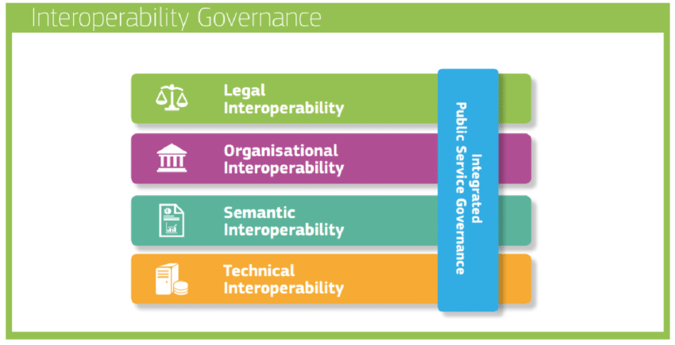
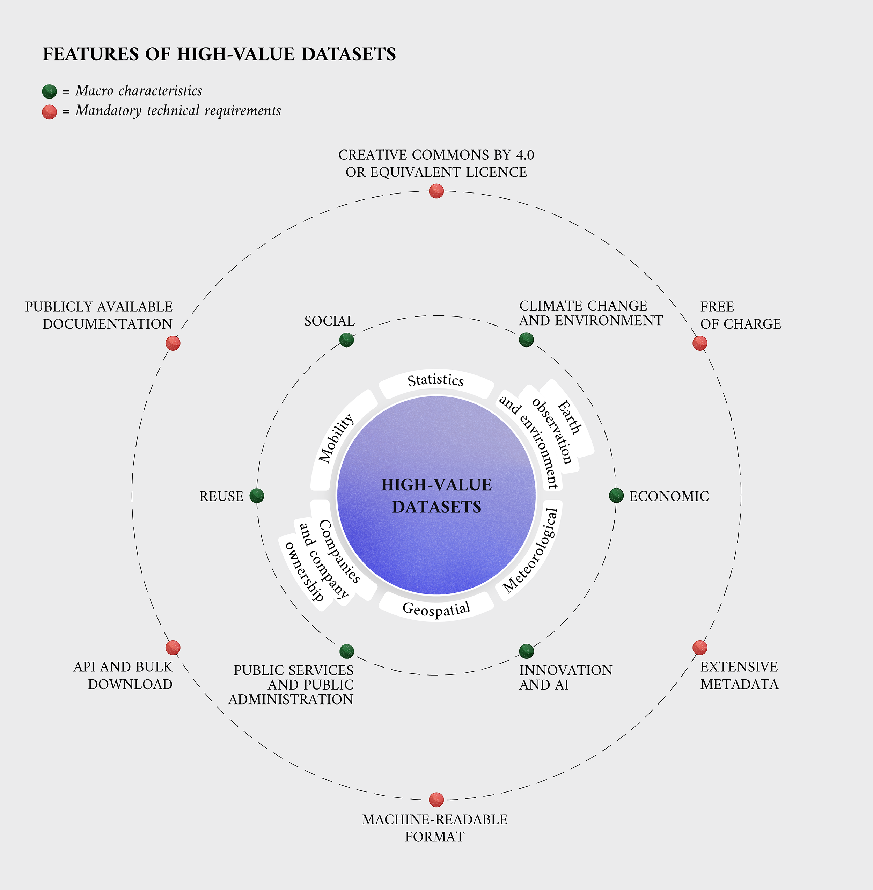

# 1.2. The European interoperability landscape

The European Commission recognizes a large economical and scientific potential when combining data from varied sources, which could allow unlocking new power and value. In 2017[^fn21], the European Commission announced the launch of the new European Interoperability Framework (EIF) [@@EUC_PO_2017]. This new framework extended a previous version published in 2010, adding 22 new recommendations to the already existing 25, for public organisations to better design and deliver services via digital channels. It was developed as a reaction to the new technological trends of the time such as open data and cloud computing, with the goal of driving publicly produced and managed data into supporting a cross-border and cross-sector digital single market for Europe[^fn22]. As indicated by its name, it is centered around the concept of interoperability, understood in this context as the ability of (public) organisations to interact and exchange information and knowledge towards mutually beneficial goals [@@EUC_PO_2017]. In concrete terms, the EIF defined a layered framework that addresses interoperability from four different orthogonal dimensions: *Legal*, *Organisational*, *Semantic* and *Technical* (see [figure 1.1](ch_1.2_eu-interop.md#figure1.1)); in line with the multidisciplinary view devised by the related literature [@@Candela_DL_2010].

<strong>Figure 1.1.</strong> Interoperability model defined by the EIF (source [@@EUC_PO_2017]).

Both the *Legal* and *Organisational* layers are focused on establishing human-centric agreements, namely coherent and non-blocking legislation frameworks across European Union (EU) member states; and clearly communicated organisational business processes that are aligned with citizen needs and aim for simplifying the achievement of common cross-border goals. For example, as in the legal regulation for Intelligent Transport Systems (ITS) directive for National Access Points [@@EUC_2017_1926] and by means of MoUs (Memorandum of Understanding) involving multiple organisations. The *Semantic* layer involves, to some degree, both human and technical agreements. A shared understanding of the meaning of concepts and their relationships is required (human-centric), while having a standardised way to define and exchange such understanding (technical). Interestingly, the EIF directly references Linked Data [@@Bizer_IJSWIS_2009] and the employment of standard and well-known vocabularies/data models as a promising alternative to address semantic interoperability, although its use is not made mandatory. Lastly, the *Technical* layer refers to the use of common protocols and communication interfaces that facilitate systems interlinking both within and across organisational boundaries. The adoption of formal and open technical specifications is advised to publish (open) data in machine-readable, non-proprietary formats. Yet, no concrete recommendation for the use of specific technologies is given.

A later reference to this set of recommendations and requirements for publishing, in this case, open data is found in the EU directive 2019/1024 [@@EUC_2019_1024], also known as the Open Data Directive (ODD). The ODD elaborated on the reuse of public sector information and it went on to further recognize the important role of open data in promoting social engagement and supporting the development of new services, based on novel ways to combine and make use of such information. In this directive, open data is understood as any data in an open format that can be freely used, re-used and shared by anyone for any purpose, in alignment with the definition given by the open data charter. The main call was to encourage Member States to promote the creation of data based on the principle of *open by design and by default*, meaning that data should be widely available for re-use, both in the public sector and for commercial purposes, with minimal or no legal, technical or financial constraints. Here it is possible to observe alignment with the guidelines previously drawn by the EIF.

Next to these recommendations, the ODD also mentioned a set of six high-value data domains: Statistics, Earth observation and environment, Meteorological, Geospatial, Companies and company ownership and *Mobility* (see [figure 1.2](ch_1.2_eu-interop.md#figure1.2)). Among the motivations for the EU Commission to highlight mobility as high-value, is the fight against climate change and the reduction of carbon footprints through the development of more efficient transportation methods. This aligns with the goals of the European Green Deal, where it is proposed, among other things, to progressively shift freight and passenger transport to rail and (inland) waterways, promote the development of alternative fueling infrastructure (e.g,. electric car charging stations) and incorporate new digital technologies to improve urban mobility. Concrete types of datasets that must be made available according to the requirements of the ODD were further specified by the Implementing Act on High-Value Datasets (IAHVD) [@@EUC_2023_138] in 2022. In the particular case of mobility, it refers to the publication of transport networks (air, rail, road and waterways) and their related infrastructure [@@EUC_2023_138, @@EUC_2007_2]. Related data types are also mentioned in the Annex of the ITS Directive, referring mainly to passenger transport related data [@@EUC_2017_1926].

<strong>Figure 1.2.</strong> Characteristics and technical requirements of high-value datasets. (<a href="https://data.europa.eu/en/publications/datastories/high-value-datasets-overview-through-visualisation" target="_blank">Source online</a>).

Following a similar narrative and shortly after the ODD was published, the EU Commission published in 2020 a document called the EU Strategy for Data (ESD) [@@EUC_2020_66]. The ESD introduced the vision for a single European data market, guided by principles of interoperability, improved access and responsible usage of data. Such data market vision would be supported by the creation of a number of common and domain-driven Data Spaces. This domain-driven strategy stems from the high-value data domains defined by the ODD and expands them to cover more specific data domains (e.g., agriculture, cultural heritage, energy, among others[^fn23]), including mobility. The creation of a common EU mobility Data Space is meant to *"position Europe at the forefront of the development of an intelligent transport system, including connected cars as well as other modes of transport"* [@@EUC_2020_66]. The above reasons serve as a motivation for this PhD work to focus on studying interoperability solutions over transport-related scenarios.

The vision introduced by the ESD, defines a Data Space as a decentralised infrastructure for trustworthy data sharing and exchange in data ecosystems based on commonly agreed principles[^fn24]. By definition, Data Spaces advocate for decentralised system architectures to enable data exchange, where data stays close to its source allowing owners to exercise sovereign governance over their data resources. Data should then be made available for (re-)use to other parties by means of standardised data models and access interfaces (aka. APIs). A preference towards decentralised solutions is also mentioned in the more recent Interoperable Europe Act (IEA) of 2024, where it is stated that ”Cross-border interoperability is not solely enabled by means of centralised digital infrastructures in the Member States, but also by means of a decentralised approach” [@@EUC_2024_903]. Data Spaces set a framework to enable both domain-centric and cross-domain data interoperability at the legal and organisational level in Europe, supported by legislation such as the Data Governance Act (DGA) [@@EUC_2022_868]. Semantic interoperability is addressed by referring to the FAIR principles[^fn25] [@@FDMMWG_2020], which are mentioned by the ESD as a strategy to ”strengthen the governance mechanisms at EU level and in the Member States relevant for cross-sector data use andfor data use in the common sectoral data spaces” [@@EUC_2020_66], and by the DGA where they should be the main guidelines for data interoperability within and across thematic Data Spaces.

In the case of Technical interoperability, a common pattern can be observed throughout EU directives and legislation, that calls for interoperable data exchange by means of Application Programming Interfaces (APIs). The ODD defines an API as *"a set of functions, procedures, definitions and protocols for machine-to-machine communication and the seamless exchange of data"* [@@EUC_2019_1024]. Next, some extracts from these documents are shown referring to this call of using open and standardised APIs:

- ODD: *"Where possible, open APIs should be used. Union or internationally recognised standard protocols should be applied and international standards for datasets should be used where applicable. […] There is general value in re-using and sharing data via a suitable use of APIs as this will help developers and start-ups to create new services and products. […] public sector bodies and public undertakings should make this available for re-use immediately after collection by ways of suitable APIs and, where relevant, as a bulk download, save for cases where this would impose a disproportionate effort. Assessment of the proportionality of the effort should take into account the size and operating budget of the public sector body or the public undertaking in question"* [@@EUC_2019_1024].

- IAHVD: *"Harmonising the implementation of the re-use conditions of high-value datasets entails the technical specification for making the datasets available in a machine-readable format and via application programming interfaces (APIs). […] Public sector bodies holding high-value datasets listed in the Annex shall ensure that the datasets described or referenced in the Annex are made available in machine-readable formats via APIs corresponding to the reasonable needs of re-users. Where indicated in the Annex, the datasets shall also be made available as a bulk download"* [@@EUC_2023_138].

- ESD: *"In order to open up key public sector reference data sets for innovation, it shall start the procedure for the adoption of an Implementing act on high-value data sets (Q1 2021) under the Open Data Directive, making these data sets available across the EU for free, in machine-readable format and through standardised Application Programming Interfaces (APIs)"* [@@EUC_2020_66].

- IEA: *"Missing interoperability specifications and standards can also hinder the development and use of innovative technologies, such as blockchain, AI or APIs"* [@@EUC_2024_903].

There is a clear consensus in the EU legislation acknowledging APIs as the *way-to-go* strategy to support technical interoperability. Yet, none of the EU legislation documents provide concrete recommendations on how APIs should be implemented in practice (i.e., what type of architectures, specifications, protocols, etc., should be adopted). A sort of fallback strategy can also be observed in these texts, advising to also make data available through bulk download services, which hints towards the non-negligible inherent costs that building and maintaining APIs can have on organisations budget, and calls for cost-efficient technical solutions. A similar position is also found coming from international organisation bodies beyond Europe, such as the OECD [@@OECD_2019].

A thorough analysis on this topic can be found in the study made by the EU JRC (Joint Research Centre) in 2020, on the existing ecosystem, challenges and recommendations for adoption of APIs in government organisations [@@JRC_2020]. This study proposes an API framework with a set of 12 recommendations to guide the administrative processes that government organisations could follow to become API -driven. Regarding concrete pointers to technological standards, the study hints towards the adoption of REST ful APIs, as defined by Fielding’s seminal dissertation [@@Fielding_2000], and shows multiple Member State examples. The argument in favour of this type of APIs stems from an initial and broad categorization of APIs on the Web into RPC (Remote Procedure Call) and REST ful, based on their architectural style. The JRC authors argue that RESTful APIs tend to establish less coupled relations between clients and servers compared to RPC APIs , which translates into more performant and scalable systems. A lower degree of coupling between clients and servers impacts also the extent to which clients and servers can be independently evolved without causing a cease of operations. An interesting remark made by this study, discusses how the adoption and implementation of APIs carries both technical and organisational cost, which if not carefully managed could ultimately discourage organisations to migrate their technology stacks.

In practice, APIs are typically designed and driven by specific use cases. It is impractical and perhaps impossible, for a data publisher trying to anticipate all the possible uses that data consumers want to have over a given dataset and thus provide a complete set of the *"most suitable"* APIs . A reasonable approach uses educated guesses to determine what are the most popular and likely use cases for a dataset and opts for providing such APIs . For all other use cases a *"fallback strategy"* is used by providing downloadable raw data dumps. Data dumps provide a simple and cheap solution for data publishers but come with an important disadvantage for data consumers, since they only contain outdated data and are incapable of incorporating updates. Once again, we can observe a clear need for cost-efficient approaches able to overcome organisational and technical cost barriers and that allow organisations to provide and maintain useful and interoperable APIs over their data resources.

[^fn21]: Coincidentally the same year I embarked myself on this PhD adventure
[^fn22]: <https://ec.europa.eu/isa2/eif_en/>
[^fn23]: <https://digital-strategy.ec.europa.eu/en/policies/data-spaces>
[^fn24]: <https://green-deal-dataspace.eu/#elementor-tab-title-7621>
[^fn25]: See also: <https://force11.org/info/the-fair-data-principles/>
