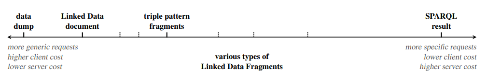
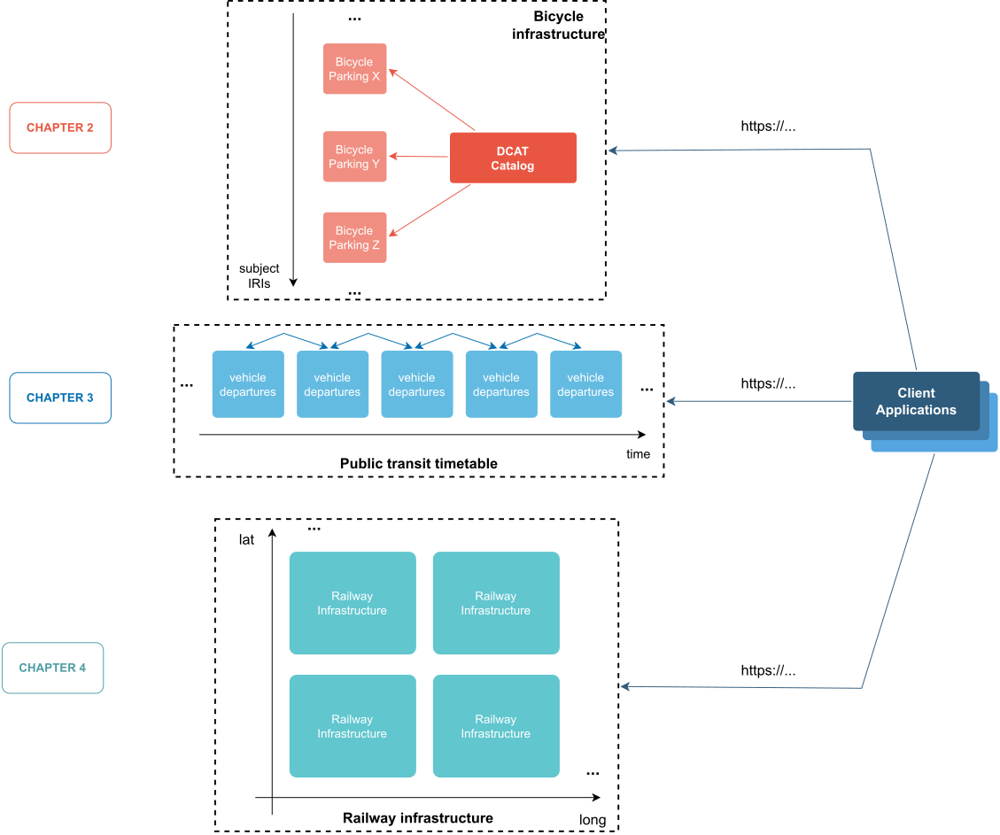

# 1.3. Towards cost-efficient Web APIs

The previous section shows multiple existing top-down initiatives and legal frameworks in the EU advocating for data interoperability by design and by default. Yet, incentives are needed (e.g,. standardised technical specifications, reference implementations, examples of migration from legacy systems, etc.) in order for organisations to put the effort into adopting and implementing new technological solutions [@@EUC_2022_721].

In recent years, an increased adoption of Linked Data technologies can be observed throughout different EU dependencies[^fn26] [^fn27] [^fn28] and initiatives following the call for developing domain-driven Data Spaces [^fn29]. Concretely for the transport domain, one initiative called the PrepDSpace4Mobility[^fn30], was launched for laying out the requirements for a EU mobility Data Space. This initiative produced a set of recommendations for interoperability where Linked Data technologies are recommended as a foundational building block. Regarding Technical interoperability for data exchange, they mention the ETSI CIM NGSI-LD standard [^fn31] as an alternative for a standardised and general-purpose information model and API specification. However, despite adopting the W3C standard JSON-LD RDF serialisation[^fn32], current NGSI-LD implementations have not been designed to manage and query data as proper RDF graphs, disregarding the semantic capabilities and the graph-based nature of the data, ultimately becoming only an HTTP API and JSON -based syntax specification [@@Abid_2022]. Furthermore, the query expressivity of a NGSI-LD API does not allow it to handle well known and legally mandated use cases such as trip planning over transport networks [@@EUC_2017_1926].

An almost ubiquitous assumption made when designing client-server Web APIs that support some sort of query language –where query language may range from simple resource identifier-based queries[^fn33] to fully-fledged SPARQL queries[^fn34] – is that the server-side must be capable of interpreting and fully processing any query expressible by the query language in question. In practice, this is often the case but is by no means a requirement for implementing a Web API supporting a certain query language. An alternative implementation for a SPARQL API, for example, can have a client-side library/application accepting SPARQL queries, decomposing them into a set of HTTP requests (supporting a possibly different query language) that retrieve a relevant subset of the data from the server-side, and then proceed to solve the query fully on the client-side[^fn35].

This is the basic principle behind Triple Pattern Fragments (TPF) and in general, behind the Linked Data Fragments (LDF) conceptual framework [@@Verborgh_2016]. LDF provides a uniform view on all possible APIs over an RDF dataset (see [figure 1.3](ch_1.3_web-apis.md#figure1.3)), where every API partitions the dataset into a particular set of fragments based on a specific selector pattern (e.g., all triples with the same subject, all triples of entities with common geospatial characteristics, etc). Each API fragmentation strategy defines a level of granularity that limits how specific a client request can be. More expressive query languages allow for higher granularity. This establishes a trade-off in terms of bandwidth (i.e., amount of data transferred on every API request) and server computational cost vs client processing time. Server-side cost in APIs is therefore dependent on the expressiveness of the query language supported by said API , which is directly correlated to the complexity of the computations needed by the server to resolve individual client requests.

<strong>Figure 1.3.</strong> Every RDF Web API offers a set of Linked Data Fragments from an RDF dataset. These fragments differ in the granularity of the data they contain, and thus the cost to create them. (Source [@@Verborgh_2016]).

LDF not only include data from the RDF dataset they originated from, but are also complemented with additional metadata and hypermedia controls that allow clients to discover and traverse the set of fragments in meaningful ways, to facilitate query solving processes. This aligns with the HATEOAS[^fn36] (Hypermedia As The Engine Of Application State) architectural constraint defined by REST [@Fielding_2000] and also shows that semantic annotations are not only useful to describe the meaning of the data present in a dataset but also of the interfaces that provide access to the data.

This PhD dissertation subscribes to the rationale presented above on the architectural characteristics of (RDF) Web APIs and studies the design of semantically interoperable and cost-efficient Web APIs over data commonly present in the transport domain. Three particular types of datasets and related use cases are described and studied in this work, namely (i) publishing of bicycle parking infrastructure, (ii) trip planning over public transport timetables and (iii) route compatibility checks over railway infrastructure. For each case, one or more specific LDF -based APIs are proposed together with their supporting system architecture and aiming on decentralised application operation.

[Figure 1.4](ch_1.3_web-apis.md#figure1.4) presents an overview of these three scenarios, focusing on the main APIs design that support each use case. It reflects the vision pursued in this work of a decentralised setup, where data is published across the Web by different organisations using cost-efficient API designs, and applications can be independently created (possibly by third-parties) to seamlessly interact with one or more of these interfaces thanks to common semantics describing both the data and their interfaces. Concretely, in the case of publishing bicycle infrastructure data, an LDF -based API is designed where data is partitioned following a subject-based fragmentation strategy, i.e., each fragment contains the complete set of triples that describe a certain bicycle parking facility. Additionally, a catalog based on the W3C standard DCAT is made available as an initial index fragment containing semantically described hypermedia links towards every other parking fragment. The second case describes an LDF -based API where data is partitioned based on the temporal properties of entities representing public transport vehicles departures. This fragmentation strategy resembles a 1-dimensional simple pagination with each fragment including semantically described hypermedia links towards the previous and next fragment in the set. Lastly, the third API design partitions railway infrastructure data based on entity geospatial characteristics. In this particular case no specific hypermedia links are made explicit among fragments, however, each fragment includes additional semantic metadata descriptions about the possible interaction mechanisms available on the API . The rationale for these specific API design strategies are described in detail in each corresponding chapter as depicted in [figure 1.4](ch_1.3_web-apis.md#figure1.4).

<strong>Figure 1.4.</strong> Overview of the LDF -based API design for each of the data types studied in this work.

Multiple research-oriented challenges arose from following these alternative API design strategies and in general, from applying Linked Data technologies in each of the previously mentioned transport use cases. In the next section we define the main research goals that were addressed in this doctoral dissertation.

[^fn26]: EU Publications Office: (i) EU Vocabularies (<https://op.europa.eu/en/web/eu-vocabularies/ontologies>) and (ii) Cellar Knowledge Graph (<https://op.europa.eu/en/web/cellar/cellar-data/metadata/knowledge-graph>)
[^fn27]: Interoperable Europe: SEMIC core vocabularies and application profiles: <https://joinup.ec.europa.eu/collection/semic-support-centre/specifications>
[^fn28]: The EU Knowledge Graph: <https://linkedopendata.eu/wiki/The_EU_Knowledge_Graph>
[^fn29]: <https://digital-strategy.ec.europa.eu/en/policies/data-spaces>
[^fn30]: <https://mobilitydataspace-csa.eu/>
[^fn31]: <https://www.etsi.org/deliver/etsi_gs/CIM/001_099/013/02.01.01_60/gs_CIM013v020101p.pdf>
[^fn32]: <https://www.w3.org/TR/json-ld11/>
[^fn33]: For example: <https://example.org/resource?id=948293>
[^fn34]: <https://www.w3.org/TR/sparql11-query/>
[^fn35]: This rationale is further elaborated in: <https://ruben.verborgh.org/blog/2021/12/23/reflections-of-knowledge/>
[^fn36]: <https://roy.gbiv.com/untangled/2008/rest-apis-must-be-hypertext-driven>
