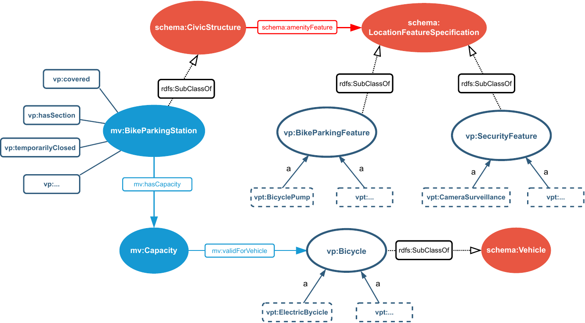

# 2.1.3 Open Velopark vocabulary

Motivated by the need of having a common data model capable of capturing all the complexity inherent to bicycle parkings, we created the [Open Velopark Vocabulary (OVV)](https://data.velopark.be/openvelopark/vocabulary). We incorporated the input of several bicycle parking managers, which includes public authorities, public transport operators and pro-cycling organizations, all having the goal of bringing reliable and useful information to bicycle users. For the vocabulary creation we followed the guidelines established by the [Best Practices for publishing Linked Data](https://www.w3.org/TR/ld-bp/) document, emphasizing on reusing standard and existing vocabularies.

<strong>Figure 2.1.</strong> Overview of OVV that shows how it relates and extends concepts from Schema.org and MobiVoc.

The core of OVV is based on MobiVoc, which is in its turn based on the Schema.org data model. OVV thus extends both MobiVoc and Schema.org to define a set of concepts and properties that are not originally considered by these vocabularies and are deemed important for providing useful information for cyclists (see [figure 2.1](ch_2.1.3_open-velopark.md#figure2.1)). The main focus of OVV extensions lies in providing definitions for bicycle parking associated services and features and more detailed descriptions of operational and physical properties of bicycle parking facilities (see [Table 2.1](ch_2.1.3_open-velopark.md#table2.1)).

| Name | Type | Extends |
| --- | --- | --- |
| [Bicycle](https://data.velopark.be/openvelopark/vocabulary#Bicycle) | Class | [schema:Vehicle](https://schema.org/Vehicle) |
| [Bike Parking Feature](https://data.velopark.be/openvelopark/vocabulary#BikeParkingFeature) | Class | [schema:LocationFeatureSpecification](https://schema.org/LocationFeatureSpecification) |
| [Security Feature](https://data.velopark.be/openvelopark/vocabulary#SecurityFeature) | Class | [schema:LocationFeatureSpecification](https://schema.org/LocationFeatureSpecification) |
| [has section](https://data.velopark.be/openvelopark/vocabulary#hasSection) | Object Property | [mv:BicycleParkingStation](http://schema.mobivoc.org/#BicycleParkingStation) |
| [has counting system](https://data.velopark.be/openvelopark/vocabulary#hasCountingSystem) | Data Property | [mv:Capacity](http://schema.mobivoc.org/#Capacity) |
| [covered](https://data.velopark.be/openvelopark/vocabulary#covered) | Data Property | [mv:BicycleParkingStation](http://schema.mobivoc.org/#BicycleParkingStation) |
| [final closing date](https://data.velopark.be/openvelopark/vocabulary#finalClosingDate) | Data Property | [mv:BicycleParkingStation](http://schema.mobivoc.org/#BicycleParkingStation) |
| [intended audience](https://data.velopark.be/openvelopark/vocabulary#intendedAudience) | Data Property | [mv:BicycleParkingStation](http://schema.mobivoc.org/#BicycleParkingStation) |
| [max parking duration](https://data.velopark.be/openvelopark/vocabulary#maximumParkingDuration) | Data Property | [mv:BicycleParkingStation](http://schema.mobivoc.org/#BicycleParkingStation) |
| [extra information](https://data.velopark.be/openvelopark/vocabulary#openingHoursExtraInformation) | Data Property | [mv:BicycleParkingStation](http://schema.mobivoc.org/#BicycleParkingStation) |
| [post removal action](https://data.velopark.be/openvelopark/vocabulary#postRemovalAction) | Data Property | [mv:BicycleParkingStation](http://schema.mobivoc.org/#BicycleParkingStation) |
| [removal conditions](https://data.velopark.be/openvelopark/vocabulary#removalConditions) | Data Property | [mv:BicycleParkingStation](http://schema.mobivoc.org/#BicycleParkingStation) |
| [restrictions](https://data.velopark.be/openvelopark/vocabulary#restrictions) | Data Property | [mv:BicycleParkingStation](http://schema.mobivoc.org/#BicycleParkingStation) |
| [initial opening date](https://data.velopark.be/openvelopark/vocabulary#initialOpeningDate) | Data Property | [mv:BicycleParkingStation](http://schema.mobivoc.org/#BicycleParkingStation) |
| [temporarily closed](https://data.velopark.be/openvelopark/vocabulary#temporarilyClosed) | Data Property | [mv:BicycleParkingStation](http://schema.mobivoc.org/#BicycleParkingStation) |

<strong>Table 2.1.</strong> OVV avoids to redefine existing concepts and adds domain-specific entities and properties.

OVV defines a core-independent [list of terms](https://data.velopark.be/openvelopark/terms#) that provides definitions to domain-specific entities such as types of parking facilities (e.g., bicycle stand, resident parking, etc), types of bicycles (e.g., electric bikes, cargo bikes, etc) and types of features (e.g., parking services and security characteristics). These entities were defined through an iterative process that involved domain experts from the different organizations involved in the Velopark project. Additionally, they were also reviewed and refined by members of the [VeiligStallen.nl](https://www.veiligstallen.nl/) technical team. VeiligStallen.nl is a bicycle parking platform from the Netherlands, that has provided an information hub over the last 10 years and was an inspiration of the Velopark initiative.
