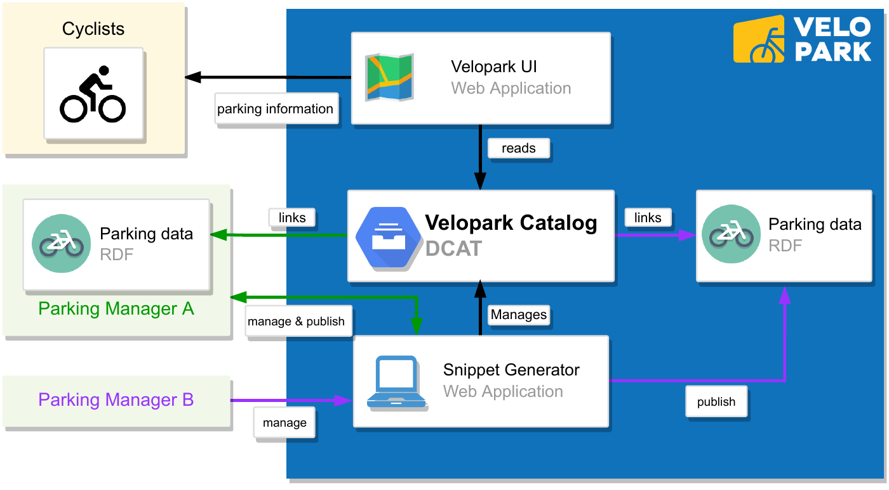
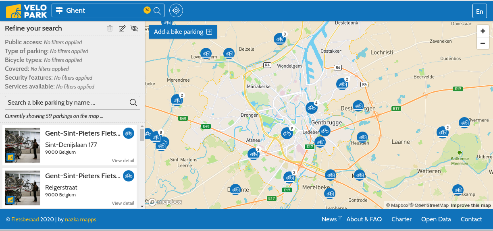

# 2.1.4 Reference architecture

The system architecture of the Velopark platform was designed to support two different strategies of bicycle parking data publishing: (i) decentralized (*Parking Manager A* in [figure 2.2](ch_2.1.4_ref-architecture.md#figure2.2)) and; (ii) centralized (*Parking Manager B* in [figure 2.2](ch_2.1.4_ref-architecture.md#figure2.2)) publishing.


<div id="figure2.2" style="text-align: center"><strong>Figure 2.2.</strong> Velopark's DCAT catalog allows applications to get a complete and reliable list of all parking facilities, enabling access to the data directly from their authoritative sources.</div>

The first strategy enables a decentralized data management process. Bicycle Parking Managers (BPMs) are able to use Velopark's *Snippet Generator* tool to describe their facilities following the OVV data model, and then opt for publish the resulting data on their own servers. Every BPM decides on how to publish the data, requiring only to make the parking facility URIs dereferenceable and set the appropriate HTTP headers for enabling CORS (Cross-Domain Resource Sharing). Some alternatives to publish the data are (i) embedding JSON-LD snippets in BPMs website HTML; (ii) using HTTP content-negotiation to give both machine- and human-oriented views of the data; or (iii) serving the data as plain RDF files. [Figure 2.2](ch_2.1.4_ref-architecture.md#figure2.2) represents scenario *iii* through *Parking Manager A*.

The centralized strategy focuses on supporting organizations with limited resources to self-host and manage the data about their parking facilities. These organizations can also use Velopark's *Snippet Generator* tool to create a data description of their facilities using the OVV model, but unlike the decentralized strategy, data is published and maintained on Velopark servers as plain RDF (JSON-LD) files. *Parking Manager B* is an example of this scenario in [Figure 2.2](ch_2.1.4_ref-architecture.md#figure2.2).

Regardless of the data publishing strategy (either centralized or decentralized), the Velopark platform remains a central and authoritative data entry point. This is achieved by maintaining a [DCAT](https://www.w3.org/TR/vocab-dcat-2/) catalog linking to all available parking facility URIs, which are in turn dereferenceable and contain the parkings data.

## 2.1.4.1 Snippet generator

This Web application (available at <https://admin.velopark.be>) is designed to enable BPMs describing their parking facilities following the OVV model. Additionally, BPMs have the possibility to manage their facilities by updating them and deciding if they are referenced in Velopark's data catalog. BPMs publishing parking data on Velopark's platform are required to follow these steps:

1. *Registration:* BPMs can be either public authorities representing a certain municipality or company representatives. They first request access to the platform which is granted by Fietsberaad Vlaanderen.

2. *Parking Description:* Once registered, BPMs can describe their facilities by entering the data in a wizard-based form, which ensures that all basic and required properties are entered.

3. *Data Publishing:* When the description of a parking facility has been completed, BPMs have the option to either self-host the data or rely on Velopark's servers to host it. In case self-hosting is chosen, BPMs need to provide the URL where the parking data will be made available. The application will generate a JSON-LD snippet (see [listing 2.1](ch_2.1.4_ref-architecture.md#listing2.1)) containing all the parking data that has to be published under the chosen URL. Otherwise, the application will generate a URI (belonging to Velopark's domain) for the parking facility and will proceed to make the data available there.

```json
{
    "@context": { "...": "..." },
    "@id": "https://data.velopark.be/data/De-Fietsambassade-Gent_Korenmarkt",
    "@type": "mv:BicycleParkingStation",
    "dateModified": "2020-02-10T22:20:45.814Z",
    "identifier": "Korenmarkt",
    "name": [
        { "@value": "Korenmarkt", "@language": "nl" },
        { "@value": "Korenmarkt", "@language": "en" }
    ],
    "temporarilyClosed": false,
    "address": {
        "@type": "schema:PostalAddress",
        "postalCode": "9000",
        "streetAddress": "Pakhuisstraat",
        "country": "Belgium"
    },
    "...": "..."
}
```
<div id="listing2.1" style="text-align: center"><strong>Listing 2.1.</strong> JSON-LD description extract of a parking facility using the OVV data model. The data file can be dereferenced at the URL defined by the <code>@id</code> property of the JSON-LD data.</div>

## 2.1.4.2 Velopark DCAT catalog

Velopark's [data catalog](https://data.velopark.be/data/catalog) is the result of the work done by BPMs on describing their parking facilities. It references all the parkings that have been approved by the BPMs to be made public, regardless of where the data is hosted (either on BPM or Velopark servers), bridging both centralized and decentralized data publishing strategies. The catalog follows the DCAT specification, defining a unique `dcat:Catalog` entity that contains multiple parkings. Each parking is represented as a `dcat:Distribution`, which data can accessed as defined by its `dcat:accessURL` property (see [listing 2.2](ch_2.1.4_ref-architecture.md#listing2.2)).

```json
{
    "@context": { "...": "..." },
    "@id": "https://data.velopark.be/data/catalog",
    "@type": "dcat:Catalog",
    "dcat:dataset": {
        "@type": "dcat:Dataset",
        "dcat:distribution": [
            {
                "@type": "dcat:Distribution",
                "dcat:accessURL": [
                  "https://data.velopark.be//data/Cyclopark_AL01"
                ],
                "dcat:mediaType": "application/ld+json",
                "dct:issued": "2020-02-04T17:12:27.035Z",
                "dct:modified": "2020-02-04T17:12:27.035Z"
            },
            "..."
        ]
    }
}
```
<div id="listing2.2" style="text-align: center"><strong>Listing 2.2.</strong> The catalog is updated via the <em>Snippet Generator</em>, immediately reflecting any changes made by the BPMs, which constitutes a reliable source of data for cyclists and third-party applications.</div>

## 2.1.4.3 Velopark user interface

This is a [Web application](https://velopark.be) targeted at cyclists and built by the Velopark team. It presents a map-based view containing all the available parking facilities of a certain region. It also creates human-oriented visualizations on top of parkings data, showing all the parking characteristics. Cyclists can filter the facilities by their properties such as features, services and physical characteristics. This application stands as an example of how Velopark's data can be discovered (via the catalog) and be directly consumed from their sources.


<div id="figure2.3" style="text-align: center"><strong>Figure 2.3.</strong> Velopark-UI view for the region of Ghent, Belgium.</div>

Another important feature of this application is the possibility for cyclists to provide feedback. If something is incorrect on the data of a particular parking facility or if some parkings are missing, cyclists can report this through the application. These reports will reach the corresponding public authority representatives responsible for the parking or the municipality mentioned in the report, which in turn can proceed to update the data where necessary.

## 2.1.4.4 Handling live data

One of the most important aspects for cyclists is to be informed about the live occupancy of a certain parking facility. Unfortunately this particular type of data is unavailable for most facilities. In the case of Velopark, only three BPMs had available an API where this data could be found: the city of Ghent (for 2 parkings), Parko (for 1 parking in Kortrijk) and Blue-Bike (for 1 parking in Vilvoorde). We continuously fetched the data available on these APIs and republished it using the OVV data model. The process to republish the live data is as follows:

1. *Data Modeling:* OVV already considers a class for representing live capacity values. The [`mv:RealTimeCapacity`](http://schema.mobivoc.org/#RealTimeCapacity) class defined by MobiVoc has precisely this purpose, which we reused.

2. *Linked Data Generation:* Since the original data comes through *ad-hoc* APIs that lack formal semantic definitions, we used RML (RDF Mapping Language) [@@Dimou_LDOW_2014] to define the rules that describe how the data of each API should be annotated to follow the OVV data model. We created these mappings using the YARRRML [@@Heyvaert_ESWC_2018] syntax.

3. *Live Data Publishing:* We published these particular parkings following the principles defined in [@@Rojas_WWW_2018] and using the Linked Time-Series Server [@@Rojas_ESWC_2018]. We extended this implementation to support RML mapping rules, by just providing the mapping files as part of the server's configuration.

An example of the republished data containing the latest available observations for the city of Ghent, can be found at <https://data.velopark.be/data/live/gent/>. Furthermore, historic data can be accessed at <https://data.velopark.be/data/live/gent/fragments> and can be traversed by following the links defined by the `hydra:previous` predicate.
