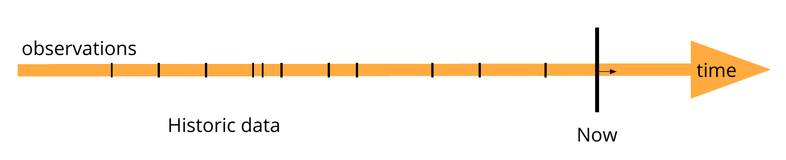

# 2.2.1 Introduction

Live open datasets, in this paper, are defined as datasets that can be modeled using a ledger-like data model, as illustrated in [figure 2.4](ch_2.2.1_introduction.md#figure2.4). Examples would be sensor observations in the public domain about e.g., air quality, noise level, street occupancy, vacant parking spaces, temperature, river water level, wind speed or state of public lighting systems and traffic lights. Furthermore, also slower changing data can be modeled as live data, for example, administrative data published by public services, such as the local decisions of a city council [@@Buyle_ISWC_2016], wanting to reduce the latency between updated legislation and user advice provided by third party interfaces. Potentially, also predictions of future, or planning data can be published, such as with public transport timetables [@@Colpaert_ICWE_2017] or occupancy predictions [@@Vandewiele_WWW_2017].

<strong>Figure 2.4.</strong> Live or real-time data are data modelled by "observations" (black ticks). A live update is when new observations come into play. Older data is historic data. Optionally, planned data or predictions can be published.

Publishing data for maximum reuse – the goal behind open data – is particularly different than sharing data between only two parties. First, one cannot anticipate on specific questions: any question can be asked with an *open world assumption*. Second, it becomes too expensive for both consumer to reuse the data, as for the publisher to share data, if there is a manual negotiation process that needs to take place. Therefore, Open Data publishing is an automation challenge on a legal, technical, syntactic, semantic and querying level [@@Colpaert_PhD_2017].

Legally, open data licenses are described as part of the [Open Definition](http://opendefinition.org). Technically, the HTTP protocol can be used to bring datasets physically together. Syntactically, the RDF 1.1 W3C specification standardizes open formats for all data that can be modeled in triples. Semantically, using HTTP URIs avoids conflicting identifiers and makes the meaning of the identifier accessible by doing a simple lookup. Data publishers can reuse URIs from existing domain models, making the data more useful to a broader audience. Using the HTTP protocol as a uniform interface, *content negotiation* can deliver different serializations for the same information resources, making the identifiers technically interoperable over software systems. Furthermore, also profiles [@@Verborgh_SDSV_2016] can be negotiated, giving a more fine-grained choice of which domain model is preferred by a user agent.

In order for clients to be able to query over different sources, we propose to look for a minimal contract between the server and the client. The looser this contract, the higher the probability that user agents can consume another dataset without modifying its code; hence, lowering the cost for adoption of heterogeneous data on the Web. In this paper we design such information system by proposing a set of requirements that follow the REST constraints and aim for maximizing reusability of live open datasets and their historic observations. Furthermore, we present a proof of concept of live open data on the Web, portraying public parking availability of several cities in Flanders. Finally, in order to have a clearer picture of the cost-efficiency trade-offs inherent to publishing live open data on the Web, we propose an experiment to study different Web interface setups that follow polling or publish-subscribe strategies.

The contributions of this paper are:

1. We propose a minimum set of technical requirements to publish live data over HTTP for the 13 biggest cities in Flanders

2. HTTP polling and publish/subscribe based approaches such as Websockets can be used to publish open data streams on the Web. We designed a preliminary experiment in order to find out under what conditions is more suitable to select one approach or the other for stream open data publishing.

The remainder of the article is structured as follows. We first describe the state of the art in [section 2.2.2](ch_2.2.2_sota.md). We then list the most important needs in an Open Data context in sections [2.2.3](ch_2.2.3_live-data.md) and [2.2.4](ch_2.2.4_time-series.md), and then describe our proof of concept implementation ([section 2.2.5](ch_2.2.5_ltss.md)) and proposed experiment to evaluate the cost-efficiency of different Web interfaces ([section 2.2.6](ch_2.2.6_evaluation.md)). A set of preliminary results are presented in [section 2.2.6.2](ch_2.2.6_evaluation.md#2262-inconclusive-results). Finally we present conclusions and directions for future work in [section 2.2.7](ch_2.2.7_conclusion.md).
