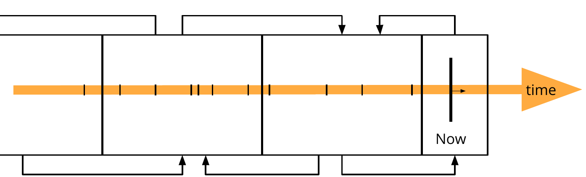

# 2.2.4 A loose contract for open time series data

Instead of creating a new information resource for each new "version" or observation, we propose to group observations in information resources. Named graphs in the RDF 1.1 specification can be used to extend triples with specific content, such as provenance data, explaining when a certain piece of data was generated. Fragments of older data have the interesting property that they will not change any longer and thus become cacheable for a long time. The only document that might change more often, is the document containing the current time. As HTTP is our uniform interface, we must set the HTTP cache headers according to this specification.

<strong>Figure 2.5.</strong> When publishing data in fragments, a generic fragmentation strategy can be thought of for "real-time" open data.

As illustrated in [figure 2.5](ch_2.2.4_time-series.md#figure2.5), one document will refer to other pages. Following R5, we must provide links between these different documents in order the find the previous or next page. The [Hydra vocabulary](http://hydra-cg.com) can do this in the body of an HTTP response, and also the Link header can provide this functionality.

We can see this approach as part of the Linked Data Fragments axis [@@Verborgh_JWS_2016] where it holds great similarities with a Linked Data Documents based solution. Located towards the far left side of the axis, it is characterized by presenting low server costs by entrusting demanding tasks such as query resolution to the clients, which is essential for open data publishers. In contrast, RSP based approaches could be located towards the far right side of the axis where server interfaces have higher costs, as most of the processing tasks are performed in the server. A solution of this kind for open data on the Web, where the number of users cannot be anticipated, may create scalability issues (R3) in limited infrastructures. Entrusting query resolution tasks to the clients to lower the cost of server interfaces for streaming data was demonstrated in [@@Taelman_ESWC_2016].

As user agents need to be able to ask questions over different sources, the terms that are used to describe certain observations must be globally unique and persistent. As the Web is our uniform interface, we choose Web addresses or URIs for our identification strategy. This enables user agents to semantically integrate datasets published by different sources. For the domain models, we recommend reusing existing vocabularies. An overview of reusable vocabularies is available at <http://lov.okfn.org> [@@Vandenbussche_SWJ_2017].

Web browsers are the ultimate HTTP client. End-user pages contain scripts which may make decisions depending on the end-user's context such as geo-location. For security reasons however, these scripts cannot access datasets on other domains by default. In order to allow this, the HTTP responses must contain a cross origin resource sharing header.

Summarizing, for adding *real-time* open data to the Web, we need to support certain HTTP features:

* Caching headers for raising the cost-efficiency and user perceived performance,
* Content negotiation if multiple specifications should be supported,
* Cross Origin Resource Sharing headers for allowing the adoption in scripts on other domains.

Furthermore, we also need extra constraints on how we distribute and describe our dataset on the Web. The minimum set of items a client should be able to count on when retrieving a document is as follows:

* Every term must get an HTTP URI that results in a document containing a definition,
* There must be an RDF 1.1 serialization as a cross-standard way of understanding the domain model,
* There must be links to earlier versions of the data,
* There must be a description of the data license in the HTTP response.

In order to speed up some use cases where large analytical queries are needed, we can extend the basic paged collection of datasets with a multidimensional interface listing statistical summaries. This however goes beyond the Hydra vocabulary today [@@Taelman_IWCL_2016].
