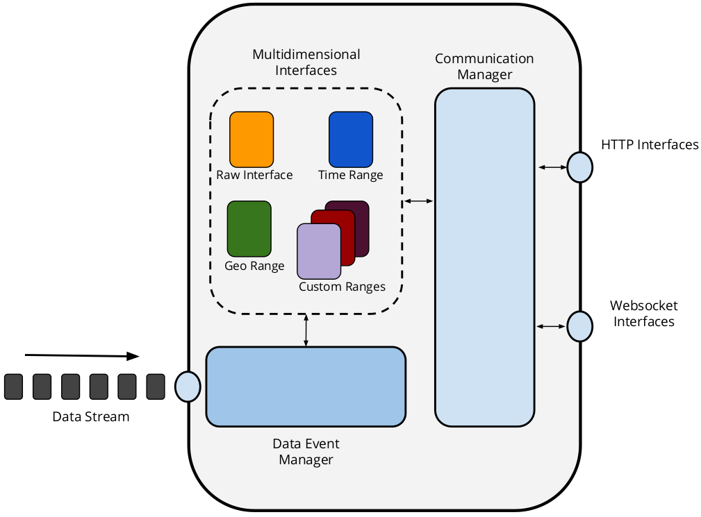
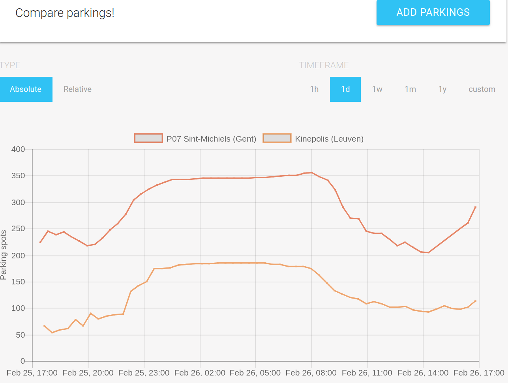

# 2.2.5 Proof of concept: Live Time Series Server

The Live Time Series Server is a proof-of-concept implementation that aims at providing a cost-efficient interface for live open data publishing. Through an extensible modular architecture, we allow data publishers to define multidimensional interfaces [@@Taelman_IWCL_2016] to provide query answering functionalities on top of their data.

Multidimensional Interfaces were introduced as an approach for generically fragmenting data with a specific order and publishing these fragments in an interface-level index. These interfaces can make multidimensional ordinal data automatically discoverable and consumable by clients using hypermedia controls. The goal of these interfaces is to raise the server expressivity while maintaining low server costs. Multidimensional Interfaces introduced a semantic vocabulary that defines 2 main concepts: *Range Fragments* and *Range Gates*. A Range Fragment is a Linked Data Fragment that specifies an ordinal interval for a predefined fragmentation strategy. A Range Gate is a Linked Data interface which exposes a set of Range Fragments. Using these concepts it is possible to define different fragmentation strategies that can be exposed as multidimensional interfaces.

In a general sense, for live time series originated from sensor observations it is possible to define ranges as follows:

* **Time Ranges:** Time constrained intervals can be used to create Range Fragments or summaries that compute statistical variables. For example to expose average values of measurements at hour, day, week, month and year level.
* **Geospatial Ranges:** Sensors locations can be used to create Range Fragments that comprises predefined geographical areas. For example, street occupation can be given on a neighbourhood, city or country level.

Depending on the type of data and the specific use case other types of fragmentations and even combinations of them can be further defined. The source code is available in a [Github repository](https://github.com/linkedtimeseries/timeseries-server), along with the instructions on how to test it.

<strong>Figure 2.6.</strong> Modular architecture of the Live Time Series server.

As shown in [figure 2.6](ch_2.2.5_ltss.md#figure2.6), the server is composed by three main modules:

* **Data Event Manager:** This module receives RDF stream updates and fires an event to notify the availability of new data.
* **Communications Manager:** Handle the communication between the Multidimensional Interfaces and the clients. It can expose the data as Range Fragments, created by each interface through HTTP endpoints or by Websocket channels for publish/subscribe communication.
* **Multidimensional Interfaces:** The interfaces expose the data stream according to its predefined logic. Each interface subscribes to a data event with the Data Event Manager and performs a new calculation with each update with the exception of the Raw Interface, which exposes the data as it is received. The data can be exposed as Range Fragments through HTTP or pushed to subscribed clients through Websocket channels.

Furthermore, a [JavaScript library](https://www.npmjs.com/package/smartflanders-data-query) was created to facilitate consuming this type of data in any kind of application. This library aims to aid developers in answering custom questions over these time series. We implemented a [demonstrator Web application](https://github.com/smartflanders/client-poc) relying on this library to consume and compare decentralised time series data of multiple parking availability datasets from various cities in Flanders, published with our Live Time Series Server. [Figure 2.7](ch_2.2.5_ltss.md#figure2.7) shows a screenshot of this application.

<strong>Figure 2.7.</strong> Screenshot of the demo Web application to compare live and historic observations of parking availability over multiple time series data sources.

