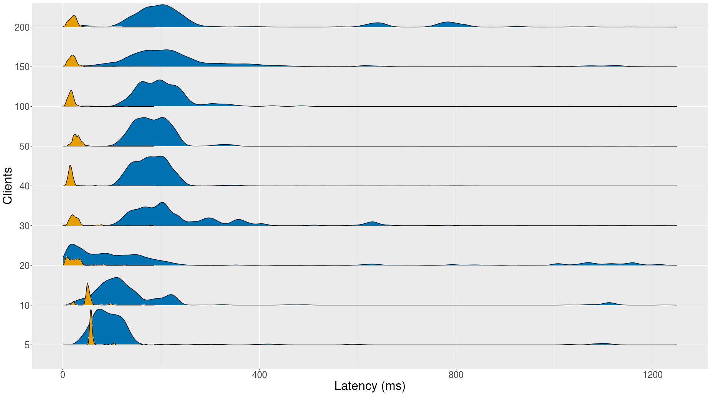
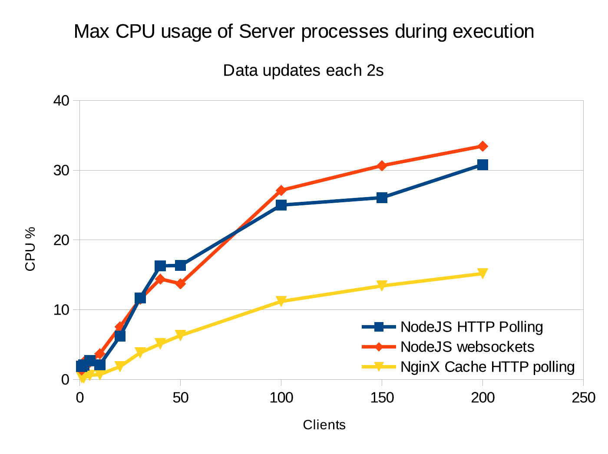

# 2.2.6 Preliminary evaluation

Publishing live data on the Web can be done either through Publish/Subscribe (pubsub) or Polling interfaces. Each of these publication strategies present different trade-offs regarding cost-efficiency of the server interface, response time latency, CPU usage and bandwidth consumption. Depending on the use case, there may be different constraints that could be fulfilled by either one of the publication strategies. Therefore, in order to have a clearer picture of how these strategies behave in different scenarios, we designed a preliminary experiment to measure server CPU usage and client-perceived latency for a Websockets-based pubsub interface and an HTTP-based polling interface, both implemented in our Live Time Series Server and exposing the same live data updates. The live data stream used for the benchmarks consists of parking site availability observations as the ones used by our previously described proof of concept. The data is provided in RDF and serialised using the Trig format. Each observation is part of a named graph, annotated using the `prov:generatedAtTime`[^fn81] predicate to specify the moment the observation was made.

## 2.2.6.1 Experiment design

For the experiment we developed a set of configurable tools that comprise a complete scenario for publication and consumption of live data updates on the Web. The experiment setup is made available as a [Github repository](https://github.com/julianrojas87/live-timeseries-evaluation) for reproducibility. Next we describe each of these tools:

* **LPDGenerator:** The Linked Parking Data Generator tool creates a dataset of parking availability observations. It is possible to configure the number of parking locations, the interval of time and the behaviour of the availability by defining, what we call events, which help to mimic peak hours throughout the day.
* **Replay-Timeseries:** This tool takes a dataset of observations and starts to emit each of them at a predefined rate on the standard output. It is possible to configure the period on which the observations will be emitted, allowing to simulate faster or slower data streams.
* **Live Time Series Server:** This refers to our proof-of-concept implementation described in [section 2.2.5](ch_2.2.5_ltss.md), which is implemented as a Node.js server, based on the Koa framework. The server receives updates through the standard input and exposes them through a HTTP interface where a client can request the latest updates. It also pushes the updates through a Websockets interface to every previously subscribed client. The server stores every update on a file-based paged collection, enabling access to historic data through a HTTP interface. It also provides metadata using the DCAT specification, containing a description of the available streams, their access method (Websockets or HTTP) and their access URL.
* **Nginx:** A Nginx instance is configured on top of the Live Time Series Server and used as a reverse proxy and HTTP cache manager.
* **Time Series-Client:** A Node.js application that can consume RDF streams either through HTTP polling or through a Websockets communication. It requests a DCAT descriptor and proceeds to consume the described streams through their corresponding protocol. For HTTP polling the client uses the Max-Age value from the Cache-Control header to determine automatically when to request the next update. For a Websocket subscription it just awaits the next update from the server. In both scenarios the client measures the perceived latency of the data using the `prov:generatedAtTime` value and the moment of reception.

The setup of the experiment is done using Docker containers and the docker-compose application to link all the containers together. In this paper we present preliminary results that were obtained using an Intel Core i5-7440HQ @ 2.8GHz x4 and 16Gb of RAM machine for the server, and an Intel Core i7 @ 3.6Ghz and 12GB of RAM machine for the clients.

## 2.2.6.2 Inconclusive results

The results on the latency, illustrated in [figure 2.8](ch_2.2.6_evaluation.md#figure2.8), show no clear trend until 200 clients and are therefore inconclusive. During the test period, we also measured the CPU-time of the server. The maximum spikes are visualised in [figure 2.9](ch_2.2.6_evaluation.md#figure2.9). Overall, the CPU consumption for both polling and pubsub remained low otherwise (&lt;3%). The only conclusion we can make from this experiment, is that up to 200 clients, we cannot determine a clear advantage for either approach. For a higher number of user agents, we will however, need to amend our tests to work in a more distributed setting.

<strong>Figure 2.8.</strong> The Websockets (orange, left) approach, until 200 clients, shows no sign of slower latency or scalability issues, compared to the polling approach (blue, right).

<strong>Figure 2.9.</strong> The maximum CPU% measured by dockerstats per process. For both HTTP polling and Websockets, there is no influence to be seen.

[^fn81]: `@prefix prov: <http://www.w3.org/ns/prov#>.`
