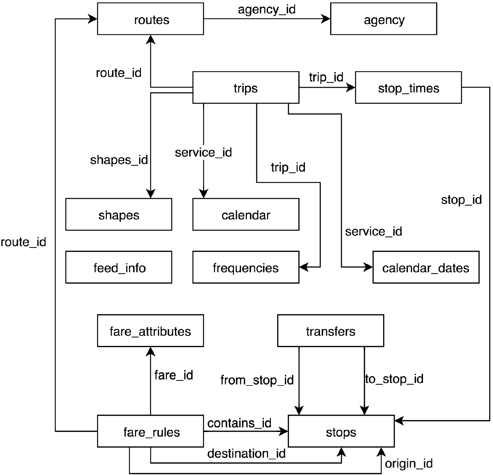

# 3.1.2 Related Work

The field of open data has been devoted to evolving the technologies that enable to share and reuse datasets, resulting in an ecosystem of data models, standards and tools. The *Linked Data principles* [@@Bizer_IJSWIS_2009] are an example of this. Semantic Web and Linked Data technologies provide a common environment where data is given a well-defined meaning, allowing machines to interpret heterogeneous datasets by using common data models and reasoning [@@Berners-Lee_SA_2001, @@Heath_MC_2011].

Next to the Linked Data principles for aligning datasets, we also consider the computational cost of sharing data. Different trade-offs can be observed between publishing a data dump, or providing a querying API, as described by the Linked Data Fragments conceptual framework [@@Verborgh_CEUR_2014]. Regarding data models and APIs for the PT domain, progress has been made as part of *Mobility-as-a-Service* (MaaS) ecosystems, aiming to provide integrated services for unified travel experiences in terms of transportation modes and payment [@@Li_JTT_2017].

In this section we present an overview of the main data sharing innovation efforts carried out in the PT domain, with route planning as its most prominent use case and an overview of such planning algorithms. Finally, we present related work regarding APIs to publish live and historical data on the Web.

## 3.1.2.1 Public transport data models

TriMet (Portland, Oregon) became the first PT operator to integrate its schedules into Google Maps in 2005. This collaboration fostered the creation of the [General Transit Feed Specification](https://developers.google.com/transit/gtfs) (GTFS), which at the time of writing, is regarded as the *de facto* standard for sharing PT data. GTFS defines the headers of 17 types of CSV files and a set of rules that describe how they relate to each other (see [figure 3.1](ch_3.1.2_related-work.md#figure3.1)). The most important files within GTFS can be listed as follows:

* **stops.txt**: Individual locations where vehicles pick up or drop off passengers.
* **routes.txt**: A route is a group of trips that are displayed to riders as a single service.
* **trips.txt**: An instantiation of a route. A trip is a sequence of two or more stops that occurs at specific time.
* **calendar.txt**: Dates for service IDs using a weekly schedule. Specify when service starts and ends, as well as days of the week where service is available.
* **stop_times.txt**: Times that a vehicle arrives at and departs from individual stops for each trip.

<strong>Figure 3.1.</strong> The GTFS data model and its primary relations.

The European Committee for Standardization created the [Transmodel](http://www.transmodel-cen.eu/) standard and its implementation [NeTEx](http://netex-cen.eu/), to provide a description of conceptual models that facilitate exchanging PT network infrastructure topology and timetable data, among others. NeTEx was selected by the European Union, for the provision of an EU-wide multimodal travel information service, where every member state will publish their PT-related datasets through a National Access Point (NAP). The official list of [NAPs can be found online](https://ec.europa.eu/transport/sites/transport/files/its-national-access-points.pdf), however to this date only a few member states shared their data in NeTEx format, which could be attributed to the difficulty for PT operators to express their networks information in a new format and data model. Recent work by Scrocca et al. [@@Scrocca_ISWC_2020] relies on semantic web technologies to ease the transition of EU operators towards NeTEx.

Efforts to semantically describe the different concepts, properties and relations defined by the aforementioned data models, were made for the case of GTFS with the [*Linked-GTFS* vocabulary](http://vocab.gtfs.org/gtfs.ttl) and for Transmodel with the Transmodel Ontology [@@Chaves_AMDI_2019]. A comprehensive survey on semantic data models and vocabularies for the transport domain was performed by Katsumi et al. [@@Katsumi_TRC_2018]. This survey does not focus only on PT but also includes other related aspects such parking and road traffic. The existence of so many different PT data models, sheds light on the lack of interoperability of the PT domain, but it also shows the efforts being made both from industry and public authorities to converge on well defined standards. Given it is mainly focused on modeling the concepts around PT planned schedules and that most PT data is available as such, we reuse *Linked-GTFS* terminology in our approach to semantically describe PT important concepts such as stops, trips and routes. However, we take a different approach to model the granular behavior of individual trips. We pair together departure and arrival events into connections, in contrast to *Linked-GTFS* that describes these events individually as a `gtfs:StopTime`. The reason for this is to facilitate the interpretation of these events to clients when evaluating route planning queries. Further details of our modeling approach are shown in [section 3.1.3](ch_3.1.3_lc-framwork.md).

## 3.1.2.2 Public transport Web interfaces

Public transport data are often found on the Web as data dumps or through APIs. Static data dumps contain extensive planned schedules, which scale proportionally to the size and complexity of the transport network [@@Fayyaz_PO_2017]. Most currently available dumps on the Web follow the GTFS model[^fn91].

Public transport APIs on the other hand, can be found online spanning a wide spectrum in terms of openness, features and data structures. From the paid [Google Directions](https://developers.google.com/maps/documentation/directions/overview) and [CityMapper](https://citymapper.com/enterprise) APIs, going over the *freemium* [Navitia.io](https://www.navitia.io/) API, to the completely free and open source routing engine [OpenTripPlanner](https://github.com/opentripplanner/OpenTripPlanner). PT data interfaces in the wild are mostly available for route planning use cases, each with their own set of features and ad-hoc data structures. Some undergoing efforts from MaaS communities are trying to define standard API interfaces (e.g. [MaaS Global](https://github.com/maasglobal/maas-tsp-api) or [TOMP](https://github.com/TOMP-WG/TOMP-API) APIs) to harmonize data access when building MaaS applications. However, despite their heterogeneity in terms of data structures and semantics, a common pattern on their architecture design can be seen across all available APIs: the servers of API providers are responsible for handling all the computational processing burden when evaluating queries, leading in practice to feature and access-restricted APIs. We propose an alternative approach where servers only are responsible of publishing self-descriptive and departure time-sorted fragments of planned schedules, through a uniform interface and data model. This approach delegates the processing of queries to the client, in a more computational load-balanced architectural setup, that ultimately lowers the costs for data publishers and brings more flexibility over the data to client applications.

## 3.1.2.3 Formal representation of public transport networks

Beyond the standards and interfaces used to describe and share PT data, is also important to consider the different formal representations that have been proposed to analyze and understand PT networks. Traditionally, PT networks have been defined through formalisms from graph theory and complex network science [@@Boccaletti_PR_2006], with different levels of abstraction that include among others, *undirected graphs* [@@Tsekeris_TP_2014, @@Gattuso_NSE_2005], *weighted and directed graphs* [@@Soh_PSMA_2010, @@Chen_RTE_2018], *time-expanded graphs* [@@Fortin_JPT_2016], and *time-varying graphs* [@@Galati_PM2HW2N_2013]. Across formalisms, vertexes normally represent physical stations in the network, and edges may represent different things depending on what is intended by the topology analysis [@@Kurant_PRE_2006]. When starting from timetable (i.e., planned schedule) data, edges are usually defined to represent connections among stops. In other words, an edge is present when there is at least one vehicle that stops consecutively in two stations, when following a predetermined route [@@Sen_PRE_2003, @@Derrible_TRR_2009, @@Ferber_EPJ_2009, @@Shanmukhappa_PA_2018].

Different metrics have been proposed to analyze and obtain insights of PT networks. General graph theory-based metrics such as *average degree* [@@Erath_NSE_2009], *graph density* [@@Tsekeris_TP_2014], *clustering coefficient* [@@Soh_PSMA_2010], and also PT domain-specific metrics such as *average connection duration* [@@Fortin_JPT_2016] or *directness of service* [@@Derrible_TR_2011] have been used to derive conclusions on the behavior of PT networks. For example, higher degree networks are typically associated with higher levels of network reliability [@@Tsekeris_TP_2014], and higher clustering coefficients reflect higher accessibility among stations [@@Lu_TST_2007]. Hong et al. [@@Hong_S_2019] present a compilation of studies that apply complex network metrics over different PT networks. However, even though graph metrics have been correlated to process performance in different application domains, for example to assess data quality change on dynamic knowledge graphs [@@Gueeret_SW_2012], to the best of our knowledge there are no studies that investigate potential relations of network graph characteristics and route planning query performance. We perform an evaluation in this direction and analyze how specific PT network graphs characteristics may influence route planning performance.

## 3.1.2.4 Route planning algorithms

From a traveler's perspective, route planning is the most popular use case over PT data and thus has been extensively studied throughout the years. Bast et al. [@@Bast_AE_2016] and Pajor [@@Pajor_PhD_2013] present a comparative analysis of multiple route planning algorithms over PT networks, road networks and combination thereof. Most PT algorithms are defined as extensions of Dijkstra's algorithm [@@Dijkstra_NM_1959] using graph-based formalizations such as *time-dependent* [@@Stolting_ENTCS_2004] and *time-expanded* [@@Pyrga_AJEA_2008] graphs to model networks. Other alternative approaches such as RAPTOR [@@Delling_ALENEX_2019], CSA [@@Dibbelt_JEA_2018], Transfer Patterns [@@Bast_ALENEX_2016] and Trip-based routing [@@Witt_ATMOS_2016] exploit the basic elements of PT networks to calculate routes directly on the planned schedules.

A PT route planning query can be further specified into more concrete problems depending on the concrete use case. The literature defines different types of route planning query problems, usually defined in terms of Pareto-optimizations, that require specific algorithm implementations with varying levels of complexity [@@Delling_ALENEX_2012, @@Dibbelt_JEA_2018]. The simplest and most common one is the *Earliest Arrival Time* problem, where given an origin, destination and a departure time τ, an algorithm should render a journey departing no earlier than τ and arriving as soon as possible. Other common problems include the *Profile problem* variants, to calculate the set of possible journeys within a time range or the *Multi-Criteria problem* for considering additional optimization criteria over the resulting Pareto set (e.g., maximum number of transfers or transport modes).

Each algorithm requires specific data structures and indexes in order to find possible routes over PT schedules. The time-based sorted structure of our publishing approach fits the requirements for executing route planning algorithms based on the Connection Scan Algorithm (CSA). In our evaluation, we take an implementation of CSA to a client-side application and use it to evaluate *Earliest Arrival Time* queries.

## 3.1.2.5 Live and historical data on the Web

Live data is critical for supporting practical use cases that are useful in real scenarios. It is particularly important for PT route planning given that in practice, schedules change due to unforeseen delays and cancellations, which could render calculated routes unfeasible. [GTFS-realtime](https://developers.google.com/transit/gtfs-realtime) and [SIRI](http://www.transmodel-cen.eu/standards/siri/), are among the main reference standards for live schedule updates and vehicle positions. Both define protocols to exchange live updates for planned schedules, modeled using GTFS and Transmodel standards respectively. Most currently available PT live data on the Web use the GTFS-realtime standard [@@Ably_2019].

In the same way, historical data is fundamental for some use cases in the PT domain. Machine learning-based algorithms require training data that closely reflect reality to make predictions on a certain scenario [@@Heppe_KI_2017]. PT operators require to perform statistical analyses based on accurate data of past events to asses the performance of their networks [@@Berkow_TRR_2009]. Such data may already exist within operators information systems, but unfortunately is not commonly made public for third party reuse. The unavailability of public historical data may be motivated by operators strategic business choices or simply by the inherent costs of maintaining a dedicated public API for this purpose. Either way limiting the development of novel use cases. An example of public historical information can be found by accessing the [Belgian trains delays and disruptions site](https://web.archive.org/web/20200429224623/https://www.belgiantrain.be/en/travel-info/current/ongoing-disturbances-and-works) through the *wayback machine* service of the Internet Archive initiative. However besides not being machine readable data, this does not constitute a reliable source as snapshots are not consistently archived.

In an effort to standardize the way historical information is accessed on the Web the IETF published the [RFC 7089](https://tools.ietf.org/html/rfc7089), also known as the Memento framework [@@VanSompel_CoRR_2009]. Memento defines a protocol over HTTP to perform time-based content negotiation of Web resources among clients and servers. The latest version of a resource is defined as the original resource URI-r. Previous versions of URI-r are defined as Mementos URI-mi with i = 1...n and can be accessed by negotiating with a *Time Gate* URI-g.

The idea of accessing and querying historical versions of data through time-based content negotiation, has been already explored by Taelman et al. for the case of time-annotated knowledge graphs [@@Taelman_JWS_2019]. In our approach we apply this principle to provide access to the history of changes of PT network schedules, which are also represented as knowledge graphs in the form of RDF. In this way we bring together both (versions of) planned and live update data, which can be queried in a cost efficient way. Design and implementation details are presented in the next section.

[^fn91]: GTFS dumps from around the world: <https://transitfeeds.com/>, <https://www.transit.land/>
