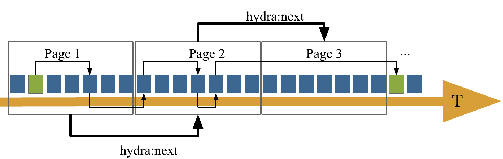
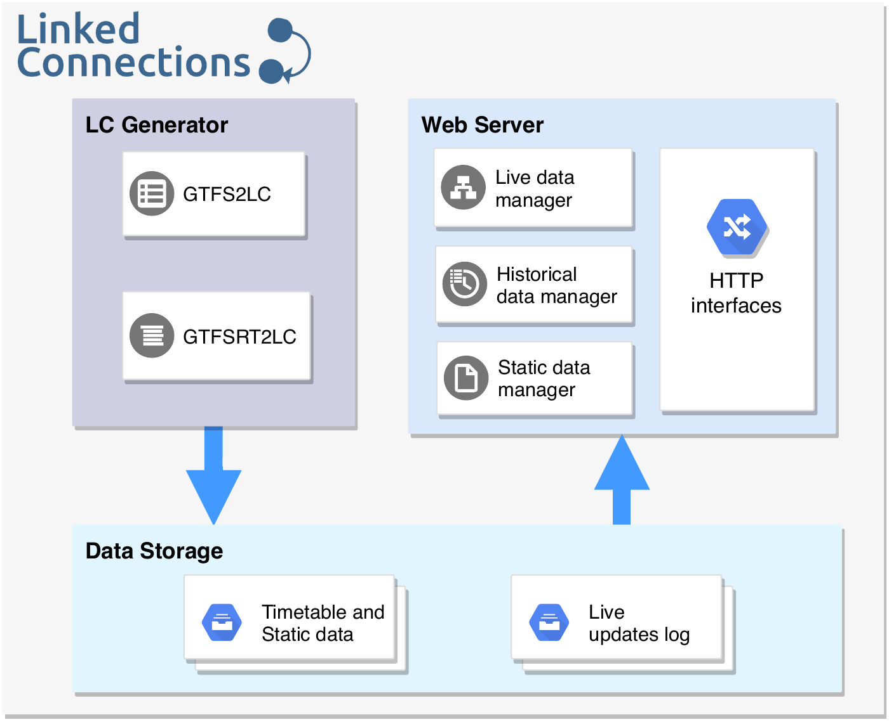
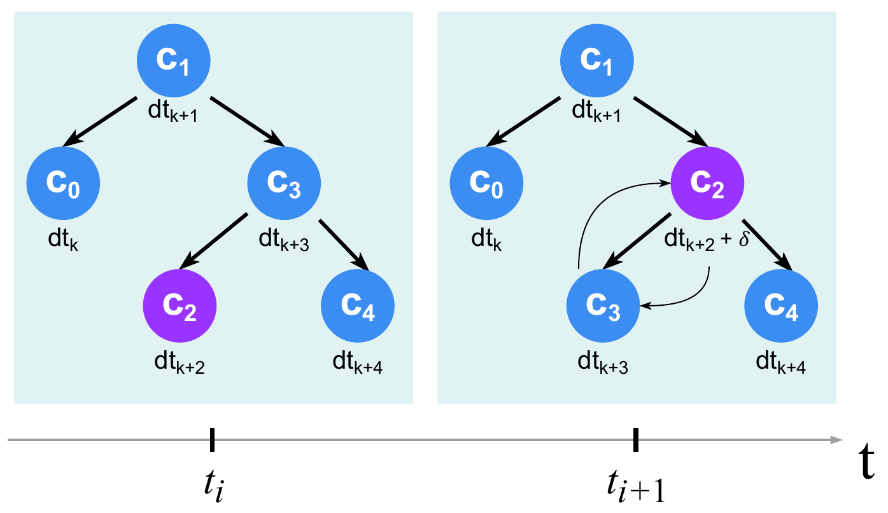

# 3.1.3 The Linked Connections framework

In previous work we introduced [Linked Connections (LC)](https://linkedconnections.org/) as a light-weight linked open data interface for publishing PT planned schedules. It allows applications to evaluate route planning queries on the client [@@Colpaert_ISWC_2015, @@Colpaert_ICWE_2017]. LC models PT planned schedules through departure-arrival pairs called *Connections*, which are ordered by departure time, fragmented into semantically enriched data documents and published on the Web over HTTP (see [figure 3.2](ch_3.1.3_lc-framwork.md#figure3.2)). Despite being designed mainly to optimize the implementation of route planning use cases, other use cases requiring different types of querying, could still be supported by the LC approach, even though other alternatives may be more efficient for specific cases. A LC interface publishes the unmodified raw data of transport schedules which for example, could allow an operator interested in finding the busiest stations during peak hours in the last month, to implement an application that traverses the LC collection to find an answer to this query, without having to implement dedicated interfaces on the server-side.


<div id="figure3.2" style="text-align: center"><strong>Figure 3.2.</strong> Depiction of chronologically ordered linked data documents containing LC (represented by the blue blocks). Each document contains links (hydra:next labeled links) to the previous and next document in the collection, that can be traversed by clients to found routes across the PT network. The green blocks represent the departure and arrival connections of an hypothetical route planning query and the thinner links comprise the route solution that will be computed by scanning the collection.</div>

Our previous work on LC mainly focused on demonstrating the feasibility of this approach and its benefits in terms of cost-efficiency for publishing PT planned schedules on the Web. We showed that LC achieves a better cost-efficiency by consuming considerably less computational resources on the server-side, when compared to traditional route planning origin-destination query interfaces. The price of this decreased server load is paid by an increased implementation complexity of client-side applications and a higher bandwidth requirement, which is three orders of magnitude bigger. This increased cost for application developers could be mitigated by setting the LC consumer as part of their server infrastructure, which in turn could expose traditional origin-destination APIs [@@Colpaert_ICWE_2017]. In our previous work however, we did not study how live PT data could be managed and accessed efficiently, nor how historical data could be archived and queried. We started exploring an approach to handle live and historical data and proved its feasibility through a preliminary demonstrator [@@Rojas_ISWC_2017]. Yet, a general overview of a LC-based system and a more detailed description of how its individual components could be implemented were still missing. To summarize, in previous work we:

* Introduced LC as publishing alternative for PT planned schedules [@@Colpaert_ISWC_2015, @@Colpaert_ICWE_2017].
* Presented preliminary demonstrators for publishing and consuming live and historical schedules [@@Rojas_ISWC_2017, @@Chaves_DSW_2017].
* Studied different Web interfaces for efficient publishing of live schedule updates [@@Rojas_WE_2020].

In this paper we build on these previous works and provide the following contributions:

* A generalized architecture to publish planned, live and historical PT schedules.
* An study of the factors that influence route planning query performance over a LC interface.
* A comparative study of the cost-efficiency and performance of our approach, against the traditional non-semantic solution OpenTripPlanner and an assessment of the added costs of publishing live and historical schedules.

Next, in this section we (i) describe the semantic specification of LC data, showing the requirements that shape the LC model; (ii) define a reference modular architecture for implementing LC-based solutions and (iii) describe in detail how we manage and provide efficient access to live and historical PT data.

## 3.1.3.1 Linked Connections specification

We created a specification that describes the different requirements to implement a LC data publishing interface and a set of considerations for client applications implementing route planning solutions.

LC uses *Connections* as the fundamental building block of PT data. A connection describes a departure-arrival event between given two stops, that occurs at a certain point in time and without intermediary halts. In other words, a connection must contain the definition of at least a *departure stop*, an *arrival stop*, *departure time* and an *arrival time*. Additionally, a connection is related to a specific *trip*. This is important for client applications to interpret sets of connections as part of independent trips during route plan calculations.

We define connections as RDF graphs, following the Linked Data principles. LC data interfaces should therefore publish data, in at least one of the RDF compliant serializations (e.g., turtle, JSON-LD, N-Triples, etc). Connections are described by means of the *linked connections* ontology and also with terms from the *Linked GTFS* vocabulary. The main concepts to semantically model and represent connections are the `lc:Connection` RDF class, together with the predicates that reference departing and arrival stops and times. [Table 3.1](ch_3.1.3_lc-framwork.md#table3.1) describes these terms and [Listing 3.1](ch_3.1.3_lc-framwork.md#listing3.1) shows an example of a LC using the JSON-LD serialization.

| Term | Description |
| --- | --- |
| [lc:Connection](http://semweb.mmlab.be/ns/linkedconnections#Connection) | Describes a departure at a certain stop and an arrival at a different stop. |
| [lc:CancelledConnection](http://semweb.mmlab.be/ns/linkedconnections#CancelledConnection) | Represents a previously scheduled departure and arrival that won't take place anymore. |
| [lc:arrivalTime](http://semweb.mmlab.be/ns/linkedconnections#arrivalTime) | The time of arrival at a certain stop. When a delay is announced, it will show that actual time of arrival. |
| [lc:arrivalStop](http://semweb.mmlab.be/ns/linkedconnections#arrivalStop) | A vehicle will stop here on arrival. |
| [lc:departureTime](http://semweb.mmlab.be/ns/linkedconnections#departureTime) | The time of departure at a certain stop. When a delay is announced, it will show that actual time of departure. |
| [lc:departureStop](http://semweb.mmlab.be/ns/linkedconnections#departureStop) | A vehicle will depart here. |
| [lc:arrivalDelay](http://semweb.mmlab.be/ns/linkedconnections#arrivalDelay) | The time (in seconds) in which the lc:arrivalTime differs from the scheduled arrival time. |
| [lc:departureDelay](http://semweb.mmlab.be/ns/linkedconnections#departureDelay) | The time (in seconds) in which the lc:departureTime differs from the scheduled departure time. |
| [gtfs:trip](http://vocab.gtfs.org/gtfs.ttl#) | Indicates the specific trip to which a connection belongs to. |
| [gtfs:pickupType](http://vocab.gtfs.org/gtfs.ttl#) | Indicates if passengers may board the vehicle at the departure stop. |
| [gtfs:dropOffType](http://vocab.gtfs.org/gtfs.ttl#) | Indicates if passengers may get off the vehicle at the arrival stop. |
| [gtfs:headsign](http://vocab.gtfs.org/gtfs.ttl#) | Contains the text that appears on a sign that identifies the trip's destination to passengers. |

<div id="table3.1" style="text-align: center"><strong>Table 3.1.</strong> Main terms used to model and semantically define LC. The prefixes <em>lc</em> and <em>gtfs</em> stand for <a href="http://semweb.mmlab.be/ns/linkedconnections#">http://semweb.mmlab.be/ns/linkedconnections#</a> and <a href="http://vocab.gtfs.org/gtfs.ttl#">http://vocab.gtfs.org/gtfs.ttl#</a> respectively.</div>

```json
{
    "@id": "http://example.org/IC2639/32",
    "@type": "lc:Connection",
    "lc:departureStop": {
        "@id": "http://example.org/228"
    },
    "lc:arrivalStop": {
        "@id": "http://example.org/210"
    },
    "lc:departureTime": {
        "@value": "2020-10-24T17:11:00.000Z",
        "@type": "xsd:datetime"
    },
    "lc:arrivalTime": {
        "@value": "2020-10-24T17:25:00.000Z",
        "@type": "xsd:datetime"
    },
    "gtfs:trip": {
        "@id": "http://example.org/IC269/20201024"
    },
    "lc:arrivalDelay": 300,
    "lc:departureDelay": 180,
    "gtfs:headsign": "Grammont",
    "gtfs:pickupType": "gtfs:Regular",
    "gtfs:dropOffType": "gtfs:Regular"
}
```
<div id="listing3.1" style="text-align: center"><strong>Listing 3.1.</strong> LC formatted in JSON-LD. The properties <em>departureDelay</em> and <em>arrivalDelay</em> indicate that live data is available for this <em>Connection</em>.</div>

A LC data interface publishes PT network schedules as a chronologically ordered paged collection of connections over HTTP. This particular design is motivated to support the execution of CSA-based algorithm implementations on the client side. The reason for choosing CSA as the main supported route planning algorithm is related to the relative simplicity of publishing CSA's required data structure, namely a chronologically ordered collection of `lc:Connection`s, compared to more complex structures and set of indexes required by other state of the art route planning algorithms. The semantic definitions provided by Linked Connections could still be reused to publish the same data, organized in different structures to enable clients performing other algorithms. For example, by exposing the ordered set of `lc:Connection`'s per `gtfs:Trip`, a client could independently implement the RAPTOR algorithm.

Each LC document should be served with the appropriate headers to enable both server and client-side caching. High cacheability of data is one of the biggest advantages of the LC approach, in terms of cost-efficiency and scalability for data publishing interfaces. Document responses require also to enable CORS (Cross-Origin Resource Sharing), given that data will be accessed by clients from multiple origins. Furthermore, LC defines semantically annotated hypermedia controls as part of every document's metadata. The purpose is to allow clients to discover and automatically navigate the PT schedules. The hypermedia controls are defined using the [Hydra vocabulary](https://www.hydra-cg.com/spec/latest/core/), including the following terms:

* **hydra:next**: Indicates the URI of the next LC document in the collection.
* **hydra:previous**: Indicates the URI previous LC document in the collection.
* **hydra:search**: Defines a URI template indicating how clients can query for a document in the collection, containing connections starting from a specific time (see [Listing 3.2](ch_3.1.3_lc-framwork.md#listing3.2)).

```json
{
    "hydra:search": {
        "@type": "hydra:IriTemplate",
        "hydra:template": "http://example.org/connections{?departureTime}",
        "hydra:variableRepresentation": "hydra:BasicRepresentation",
        "hydra:mapping": {
            "@type": "IriTemplateMapping",
            "hydra:variable": "departureTime",
            "hydra:required": true
        }
    }
}
```
<div id="listing3.2" style="text-align: center"><strong>Listing 3.2.</strong> Hydra search form defining a URI template for accessing LC documents with connections departing no earlier than the requested time. It explicitly defines how clients can request specific documents and the variables they are allowed to use. In this case the only variable is the <code>departureTime</code>.</div>

## 3.1.3.2 Linked Connections reference architecture

A LC system's main purpose is to publish PT schedules as a chronologically ordered collection of vehicle departures over HTTP, while taking into account live updates to the original schedules and keeping historical data available for later querying. To this end we define a reference architecture (see [figure 3.3](ch_3.1.3_lc-framwork.md#figure3.3)) with three main modules that *generate*, *store* and *serve* LC. We also provide a complete and open-source reference implementation of this architecture as a [Node.js application](https://github.com/linkedconnections/linked-connections-server).


<div id="figure3.3" style="text-align: center"><strong>Figure 3.3.</strong> Reference architecture for LC-based systems.</div>

### LC Generator

This module is responsible for creating LC. It takes GTFS (planned schedules) and GTFS-realtime (live updates) data sources as input, given that most PT data is available in these formats. We provide implementations for both modules through the [*gtfs2lc*](https://github.com/linkedconnections/gtfs2lc) and [*gtfsrt2lc*](https://github.com/linkedconnections/gtfsrt2lc) Node.js libraries. However, thanks to the modular nature of the architecture, it is possible to replace these modules with any other interfaces capable of creating LC from different data sources (e.g., Transmodel, APIs, etc). One of the most important aspects that need to be considered when creating LC is the provision of a stable identification (URI) strategy that remains valid across versions of the data sources. We make possible to define such strategy using URI templates as defined by the [RFC 6570 specification](https://tools.ietf.org/html/rfc6570).

### Data Storage

The output of *LC Generator* is received by this module, which proceeds to fragment and store the data according to a given fragment size. Static LC (i.e. data coming from a planned schedules) are stored as individual files that correspond to the documents of the time-ordered LC collection. Additionally, files containing the set of *stops* and *routes* of the PT network are kept to be served as static documents too, since they are usually needed by route planning applications. Live updates are also stored as files following a log-like approach, where delays, ahead of time and cancellation reports for every single connection are written down. Files in both cases are named using the first departure datetime they contain to facilitate later connection lookups.

### Web Server

This module defines the interfaces through which LC and other related PT data may be accessed by client applications. The HTTP interfaces supported by the LC Web server are as follows:

* `/connections`: This interface provides access to the LC documents. It receives a departure time query parameter, as seen in [listing 3.2](ch_3.1.3_lc-framwork.md#listing3.2), used to obtain the document with connections departing on a specific time. If not provided it will resolve to the current time document.
* `/stops`: This interface returns the complete set of stops defined for the PT network as a static document. Stops are described with terms from the *Linked GTFS* vocabulary.
* `/routes`: This interface returns the complete set of routes available in the PT network as a static document. It includes information like route number/name, color or type of vehicle (e.g. metro, tram, bus, etc) which are also described with the *Linked GTFS* vocabulary. Route data are useful for displaying route plan results in user applications.
* `/catalog`: This interface provides a catalog definition given using the DCAT vocabulary. It describes the different data sources published on the server, including their access URLs, supported media type formats, last issued date, license information, among other metadata. Its main purpose is to increase discoverability of the data.

The *Web Server* module also contains submodules responsible for resolving LC documents requests in an efficient way. Particularly the architecture defines three specific submodules for supporting requests that include live data, historical data and also static data. The *live data manager* submodule takes care of serving LC documents that include the latest connection updates. A detailed reference implementation of this submodule is presented later in [section 3.1.3.3](ch_3.1.3_lc-framwork.md#3133-serving-live-linked-connections). In the same way, the *historical data manager* handles serving previous versions of LC documents through HTTP time-based content negotiation using the Memento protocol. A reference implementation is detailed in [section 3.1.3.4](ch_3.1.3_lc-framwork.md#3134-serving-historical-linked-connections). Lastly, the *static data manager* handles requests for static resources, namely *stops*, *routes* and the server's DCAT metadata.

## 3.1.3.3 Serving live Linked Connections

Managing and serving live schedules updates, without sacrificing the cost-efficiency of the data publishing interface, constitutes one of our main contributions in this paper. In previous work we studied pushing (server-sent events) and polling (HTTP) interfaces to exchange live PT data with client applications and keep route planning results updated in a cost-efficient way. We found that a polling approach consumes less resources on the data publishing side and clients only experience a slightly higher bandwidth consumption, compared to a pushing approach [@@Rojas_WE_2020]. However, our implementation for serving live LC was done in a naive way. We merged scheduled LC documents with their latest updates on request time, with significant negative impact on response times.

We introduce a more elaborated approach to reduce response times of LC document requests without compromising cost-efficiency. The set of departure time-sorted Linked Connections C = [c<sub>0</sub>, c<sub>1</sub>, …, c<sub>n</sub>] where dt<sub>k</sub> is the departure time of c<sub>k</sub> and dt<sub>k</sub> ≤ dt<sub>k+1</sub>, is modeled as an AVL tree [@@Skii_SMD_1962] (see [figure 3.4](ch_3.1.3_lc-framwork.md#figure3.4)). AVL trees are self-balancing binary search trees, where at any time, the height difference between two child subtrees of any node is not bigger than 1. Insert and delete operations are performed in logarithmic time and the strict balancing ensures consistent response times on data lookups. We implemented an AVL tree in our LC architecture represented by the *live data manager* submodule in [figure 3.3](ch_3.1.3_lc-framwork.md#figure3.3). The tree creates a time window view over the LC collection, spanning from the current time until a configurable time in the future. This time window is periodically adjusted by shifting forward in time, based on the assumption that most route planning queries will request future routes and also to avoid unnecessary memory consumption by keeping old connections. In practice, the tree is built by loading in memory scheduled LC documents, starting from the one that contains connections departing on the current time and periodically rebuilding the tree to shift forward the time window. However, data outside the time window can still be provided by merging scheduled documents and their updates on request time. The AVL tree data structure is updated accordingly (i.e. adding, removing and reorganizing connections) upon reception of schedule update reports. This allows for fast LC document responses containing the latest schedules updates. [Figure 3.4](ch_3.1.3_lc-framwork.md#figure3.4) shows an example of an AVL tree of LC and how the tree is adjusted when a connection is reported to have departure delay.


<div id="figure3.4" style="text-align: center"><strong>Figure 3.4.</strong> Depiction of the LC AVL tree reacting to a schedule update. In this example, c<sub>2</sub>'s departure time is dt<sub>k</sub>+2 at t<sub>i</sub>. A moment later at t<sub>i</sub>+1, c<sub>2</sub>'s departure time is reported to be increased by a delay δ, making c<sub>2</sub>'s departure time to be later in time than c<sub>3</sub>'s departure time. This schedule update triggers a reorganization of the AVL tree to maintain the chronological ordering of the collection.</div>

The AVL tree is initially generated by scanning over the scheduled LC, kept by the *Data Storage* module on server boot time. Once created, the live update logs are constantly monitored and trigger tree reorganizations when new reports are received.

## 3.1.3.4 Serving historical Linked Connections

Another important contribution of this paper, is providing the ability for serving historical LC data. We allow querying not only for past planned schedules but also for historical live data reports. This means it is possible to obtain the actual vehicle departures as they were reported at different points in time. For example, we could request for the departures of yesterday at 08:00h as they were expected to be yesterday at 07:00h and also later at 07:50h, seeing possibly that a connection that was on time at 07:00h was later reported to be delayed at 07:50h. In this way is possible to reproduce the stream of events of a PT network at a granularity given by the frequency of live update reports. Access to this data could support analytical studies to better understand the behavior of PT networks and also other use cases that rely on historical information of trips to provide recommendations to travelers [@@Chaves_DSW_2017].

We make this possible through the HTTP Memento protocol. Given the document-based nature of LC, it is possible to request past versions of a specific document, as it was at a certain point in time. Memento defines different patterns to perform time-based content negotiation. We implemented pattern 1.1 where URI-r = URI-g and 302-style negotiation is performed. This means that the original resource acts as its own time gate and clients receive a 302 HTTP response containing a `Location` header with the URI of the Memento. An example `GET` request is shown in [listing 3.3](ch_3.1.3_lc-framwork.md#listing3.3), asking for connections departing from 08:00h as they were reported at 07:35h. The specific version time is given through the `Accept-Datetime` header, as defined by the Memento protocol.

```http
GET /connections?departureTime=2020-10-15T08:00:00.000Z HTTP/1.1
Host: example.org
Accept-Datetime: Thu, 15 Oct 2020 07:35:00 GMT
Connection: close
```
<div id="listing3.3" style="text-align: center"><strong>Listing 3.3.</strong> Hydra URI template for accessing LC documents containing connections with departure times equal or bigger than the requested time.</div>

Performing these kind of queries is possible thanks to the way LC are stored in the *Data Storage* module, as separate sets for both scheduled and live update data. When a Memento request is received, the system gets first the LC fragment containing the originally scheduled connections. This first step may seem trivial but is necessary to consider that there may be multiple versions of overlapping planned schedules. Therefore, the system needs to select the version issued closest to the specified `Accept-Datetime` date, before integrating live reports. Then the system goes over the live update logs for this specific LC document, retrieving and merging all the updates received up until the `Accept-Datetime` date. As mentioned in [section 3.1.3.3](ch_3.1.3_lc-framwork.md#3133-serving-live-linked-connections) this could be considered as a naive approach which may increase response times of individual LC fragments. However we part from the assumption that historical data queries are not as performance-critical as live data queries for route planning purposes, and can still be resolved within reasonable time following this approach.

## 3.1.3.5 Linked Connections client

The chronological ordered collection of connections defined by a LC system, is a fitting data structure to perform the *Connection Scan Algorithm* (CSA), proposed by Dibbelt et al. [@@Dibbelt_JEA_2018]. Given a departure stop, arrival stop and departure time, CSA will go over the collection of connections, progressively building a minimum spanning tree of reachable destinations. The algorithm performs this process until it reaches the desired arrival stop, rendering in this way, the earliest arrival journey possible (if any). This provides a solution for the *Earliest Arrival Time* problem. In the case of LC, a client performing the CSA algorithm can scan through the collection of connections by downloading LC documents and following the defined hypermedia controls to traverse it. We provide an implementation of CSA on the [Planner.js JavaScript library](https://planner.js.org/), which can be used both on server (Node.js) and client-side applications.
