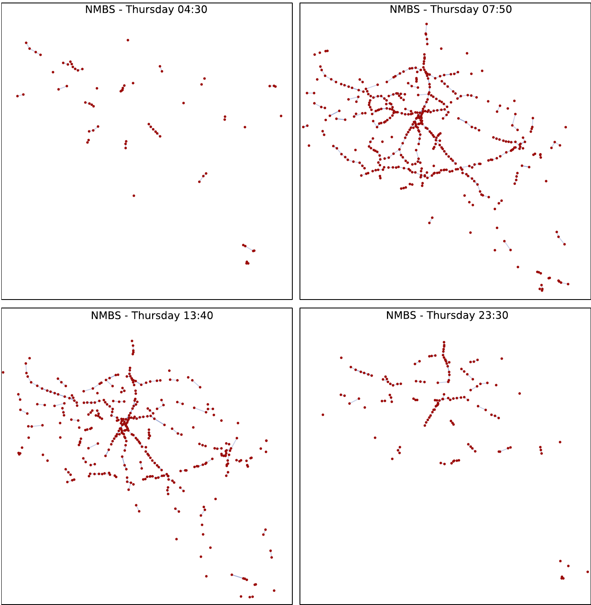

# 3.1.4 Datasets and Metrics

For testing our proposed approach we conducted a set of evaluations (see details in [section 3.1.5](ch_3.1.5_evaluation.md)) considering data from 22 real-world PT networks. Aiming on getting generalizable results, we selected a representative set of heterogeneous PT networks in terms of modes of transport and geographical coverage (urban, regional, national and international). In this section we describe these PT networks, our modeling approach to represent them and a set of measured graph topological characteristics.

We rely on the definitions of network topology introduced by Kurant and Thiran [@@Kurant_PRE_2006]. In particular, we use graph topologies in *space-of-stops*, to reflect the traffic flow of the PT transport networks. Considering that these type topologies are inherently time-dependent, we opted to model them as *Time-Varying Graphs* (\\(TVG\\)). The main purpose was to capture more accurately their dynamic behavior and evolution [@@Galati_PM2HW2N_2013]. Traditional aggregated static graphs may be a severe oversimplification that fails to represent the number and particularly the frequency of relations that take place in a dynamic system [@@Nicosia_TN_2013]. As an example of how much a PT network topology (in *space-of-stops*) may change over time, [Figure 3.5](ch_3.1.4_datasets.md#figure3.5) shows 4 snapshots of the Belgian train PT network graph, taken at different points in time throughout an operation day. In the rest of this paper, PT network topologies are always considered to be in *space-of-stops*.


<div id="figure3.5" style="text-align: center"><strong>Figure 3.5.</strong> Network graph snapshots of the Belgian train PT operator NMBS, taken over the busiest day of their timetable. It can be observed how the topological structure of the network varies throughout the day, in particular showing a higher amount of connections between stops during peak hours.</div>

\\(TVG\\)s are typically defined by an ordered-set of \\(T\\) snapshot graphs \\(G_1, G_2, \dots, G_T\\), where each \\(G_t\\) represents a state of the network at a certain point in time. \\(G_t = (V, E_t)\\) where \\(V\\) is the constant set of vertexes (stops) and \\(E_t\\) represents the temporal configuration of edges (connections) that take place on the network at \\(t\\). We take \\(T\\) at the maximum resolution allowed by the timetable data of 1 minute, to capture better the state of the networks during the observed time interval. Edges may be persistent across graph snapshots, according to the travel duration of the connections they represent.

Based on related work about analytical frameworks to study PT networks [@@Galati_PM2HW2N_2013, @@Tsekeris_TP_2014, @@Gattuso_NSE_2005, @@Soh_PSMA_2010, @@Chen_RTE_2018], but mainly aiming to reflect their dynamic behavior and topological changes over time, we decided to observe the following graph properties of each network:

* *Size*: Size is a basic graph property, in this case interpreted as the total number of stops \\(|V|\\) present on the network.

* *Average Degree*: Degree \\(k\\) is measured on a vertex as the sum of its incoming and outgoing edges, interpreted in this case as departing and arriving connections. For every graph snapshot \\(Gt\\), we take the average degree of all vertexes. The \\(TVG\\) average Degree is then calculated as the average graph Degree over graph snapshots:

  \\[K = \frac{1}{|T|*|V|} \sum_{t \in T} \sum_{v \in V}k \\]

  The average degree of a network shows how connected is each vertex in the network [@@Hong_S_2019].

* *Density*: Graph Density \\(D\\) is an indicator aimed at measuring how close is the network structure to a complete graph. It is defined as the ratio of existing edges and the total number of possible edges in the network. We calculated the total Density of the \\(TVG\\) as the average Density of the individual graph snapshots:

  \\[D = \frac{1}{|T|}\sum_{t \in T}\frac{|E_t|}{|V|*(|V| - 1)} \\]

  An increased density is usually an indication of reduced time travelling in PT networks [@@Tsekeris_TP_2014].

* *Clustering Coefficient*: Clustering Coefficient \\(C\\) is a measurement of how well connected are the neighbors of a given vertex. Is defined as the ratio of existing edges and total possible edges among neighbors of a vertex, which is averaged for all the vertexes in the network. We measured the total \\(C\\) of the \\(TVG\\) as the average for all the snapshot graphs \\(Gt\\):

  \\[C = \frac{1}{|T|*|V|}\sum_{t \in T}\sum_{v \in V}\frac{2|e|}{|n|*(|n| - 1)} \\]

  where \\(e\\) is the number of edges present among neighbors of vertex \\(v\\) and \\(n\\) is the total number of neighbors of \\(v\\). A highly clustered network is usually a reflection of a better connected and accessible network [@@Lu_TST_2007].

* *Average Connection Duration*: This metric is a particular measure of time-dependent networks, which indicates in this case, how long are the trips that occur on the network [@@Fortin_JPT_2016]. From a LC system perspective is interesting to see how longer or shorter trips in PT network may influence route planning performance, considering the time-based nature of LC data interfaces. We calculate Average Connection Duration over the LC collection as the average difference of arrival and departure times for every connection \\(ACD = c_{at} - c_{dt}\\).

We measured the aforementioned metrics on each of the 22 considered PT networks. [Table 3.2](ch_3.1.4_datasets.md#table3.2) presents a condensed view of the measured metric values. We observe high heterogeneity in the different measured metrics. For the total number of stops (\\(|V|\\)), we have the *Kobe-Subway* network as the smallest with 27 stops, and the *Wallonia-TEC* network as the biggest with a total of 31,131 stops. In the case of total number of trips, *Sydney-Trainlink* has the least number with 103 and *Flanders-De Lijn* has the highest number with 33,959. *Sydney-Trainlink* has also the lowest number of connections with 891 and *Chicago-CTA* has the highest with almost 1.13 million connections.

| PT network | \\(\|V\|\\) | trips | connections | smallest fragment | \\(K\\) | \\(D*1000\\) | \\(C\\) | \\(ACD\\) |
| --- | ---: | ---: | ---: | ---: | ---: | ---: | ---: | ---: |
| Kobe-Subway | 27 | 617 | 6,086 | 16 | 6.59 | 84.55 | 0 | 2.57 |
| Netherlands-Waterbus | 44 | 515 | 936 | 7 | 1.17 | 9.14 | 0 | 11.08 |
| San Francisco-BART | 50 | 754 | 7,755 | 15 | 9.28 | 63.14 | 0.19 | 4.53 |
| Thailand-Greenbus | 112 | 137 | 1,024 | 16 | 3.20 | 9.62 | 0.97 | 83.81 |
| Auckland-Waiheke | 125 | 243 | 6,020 | 5 | 0.15 | 0.41 | 0 | 1.60 |
| Sydney-Trainlink | 361 | 103 | 891 | 7 | 0.19 | 0.17 | 0.01 | 51.24 |
| London-Tube | 379 | 15,356 | 321,952 | 376 | 1,056.55 | 931.70 | 6.77 | 2.51 |
| Germany-DB | 433 | 677 | 7,680 | 21 | 4.47 | 3.45 | 6.58 | 33.05 |
| Belgium-NMBS | 606 | 4,556 | 57,950 | 94 | 35.36 | 19.48 | 0.54 | 5.66 |
| Spain-RENFE | 714 | 997 | 6,159 | 27 | 3.48 | 1.62 | 2.69 | 32.97 |
| Amsterdam-GVB | 1,356 | 11,367 | 180,695 | 71 | 0.68 | 0.24 | 0.001 | 2.11 |
| EU-Flixbus | 1,744 | 8,726 | 51,636 | 386 | 162.01 | 30.98 | 27.14 | 133.05 |
| New Zealand-Bus | 2,259 | 4,678 | 153,690 | 59 | 0.50 | 0.07 | 0.03 | 2.01 |
| Brussels-STIB | 2,316 | 19,557 | 350,038 | 189 | 2.47 | 0.35 | 0.13 | 1.76 |
| Nairobi-SACCO | 2,787 | 264 | 5,855 | 259 | 6.71 | 0.80 | 1.26 | 4.69 |
| New York-MTABC | 3,590 | 11,028 | 343,582 | 130 | 1.19 | 0.11 | 0.59 | 4.19 |
| France-SNCF | 4,646 | 10,541 | 79,796 | 180 | 20.19 | 1.44 | 2.57 | 16.52 |
| Madrid-CRTM | 5,192 | 27,538 | 706,642 | 247 | 3.93 | 0.25 | 2.61 | 5.49 |
| Helsinki-HSL | 8,155 | 25,887 | 689,834 | 877 | 130.76 | 5.34 | 3.78 | 1.62 |
| Chicago-CTA | 11,042 | 20,058 | 1,128,828 | 164 | 2.20 | 0.06 | 0.33 | 1.37 |
| Flanders-De Lijn | 29,905 | 33,959 | 826,572 | 1861 | 117.11 | 1.30 | 1.62 | 1.56 |
| Wallonia-TEC | 31,131 | 21,062 | 623,808 | 1207 | 36.02 | 0.38 | 3.99 | 1.55 |

<div id="table3.2" style="text-align: center"><strong>Table 3.2.</strong> Set of evaluated PT networks and their metric values. The networks are organized from the smallest to the biggest with respect to the number of active stops during their busiest day (i.e. the day with the highest number of connections). Number of trips and connections correspond to the total amount that took place during the busiest day of the schedule. <em>K</em> is the average degree, <em>D</em> is the density (shown as a factor of 1000 to facilitate readability), <em>C</em> is the clustering coefficient, <em>ACD</em> is the average connection duration (in minutes).</div>

We can see that more stops does not necessarily means more connections. *Sydney-Trainlink* (least connections) has 13 times more stops than *Kobe-Subway* (least stops). In the same way, *Chicago-CTA* (most connections) has less than half the stops of *Wallonia-TEC* (most stops). Having the least connections is a reflection of also having the least trips in the case of *Sydney-Trainlink*. However, *Flanders-De Lijn* (most trips) has 5.6 times more trips but 30% less connections than *Chicago-CTA* (most connections). Such difference is explained by *Chicago-CTA*'s trips being larger in terms of visited stops, which translates into higher number of connections.

The smallest fragment size, which is given in number of connections, has *Auckland-Waiheke* as the network with the smallest fragment possible: 5 connections per fragment. *Flanders-De Lijn* has the biggest among all networks with a minimum possible fragment of 1.8k connections. This metric reflects how many simultaneous connections take place at the busiest moment of the schedule.

Looking at the average degree \\(K\\), *Auckland-Waiheke* shows again the lowest value with 0.15 and *london-tube* presents the highest with 1056.55, showing a significant difference compared to the rest of the networks. This indicates that throughout the day, most of *London-Tube*'s stops are constantly active, which is evident by the high number of connections compared to the low total number of stops showed by this network. For density \\(D\\), we observe that values range from 0.00006 for *chicago-cta* to 0.93 for *London-Tube*. We also see that networks with high \\(K\\) and relatively lower number of stops show the highest values of \\(D\\), as is the case of *Kobe-Subway*, *San Francisco-BART* and *London-Tube*.

For clustering coefficient \\(C\\), we can see that three of the networks, namely *Auckland-Waiheke*, *Netherlands-Waterbus* and *Kobe-Subway* have \\(C = 0\\). We see that these networks have in common a relatively small number of stops, a low number of simultaneous connections (given by the smallest possible fragment size) and relatively low \\(ACD\\). In contrast to *EU-Flixbus* that has the highest \\(C = 27.14\\) and also the highest \\(ACD\\). This pattern can be explained by the fact that having low number of stops and \\(ACD\\), lowers the probability to find a stop \\(v_k\\) that at any given time, has connections with two neighbor stops \\(v_{k+1}\\) and \\(v_{k+2}\\), at the same time that \\(v_{k+1}\\) is also connected to \\(v_{k+2}\\). In the case of *EU-Flixbus* we could infer that is easier to find simultaneous buses travelling among neighbor stops, given the higher \\(ACD\\) of this network. An example of this scenario in *EU-Flixbus* is show in [listing 3.4](ch_3.1.4_datasets.md#listing3.4).

```text
Paris CDG Airport @00:10 -----> Brussels South @03:30

Paris CDG Airport @00:20 -----> Paris (Bercy Seine) @00:55

Paris (Bercy Seine) @00:53 -----> Brussels South @03:30
```
<div id="listing3.4" style="text-align: center"><strong>Listing 3.4.</strong> Example of a cluster in <em>EU-Flixbus</em>. Given the long duration of the two connections departing from France to <em>Brussels South</em>, when the connection between the two french stops takes place, the other two connections are still happening, therefore a cluster (triangle) can be formed in the graph.</div>

Lastly, we see that the values for average connection duration range from 1.37 minutes of *Chicago-CTA* to 133.05 minutes of *EU-Flixbus*. This is expected, since urban networks normally have shorter connection durations compared to nation-wide or international networks such as *Thailand-Greenbus* and *EU-Flixbus*.
