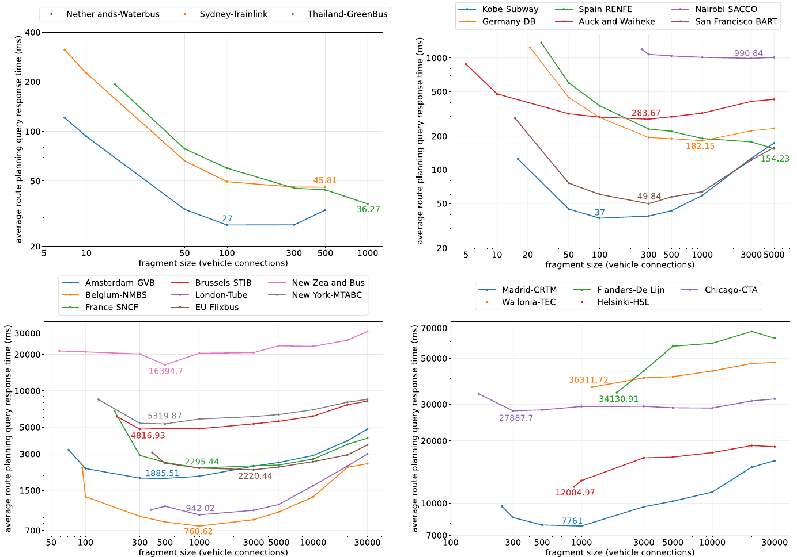
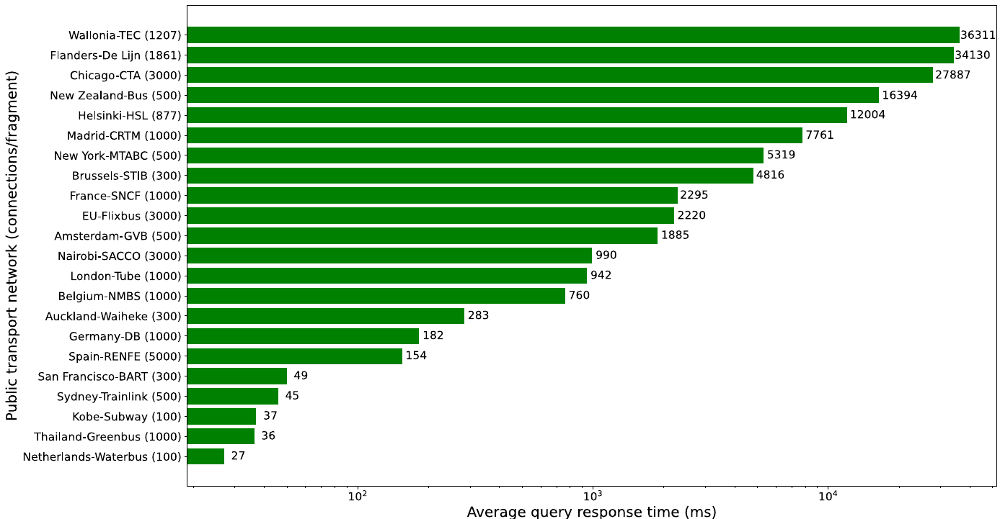
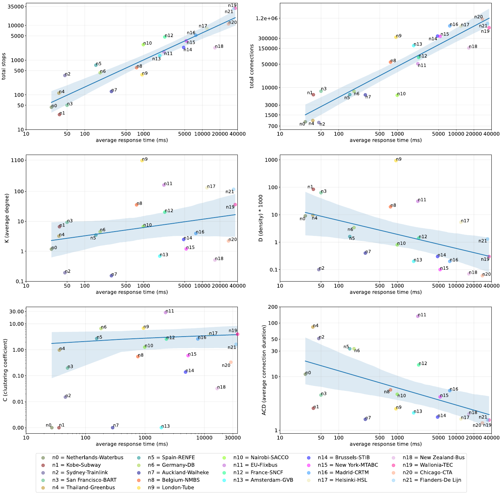
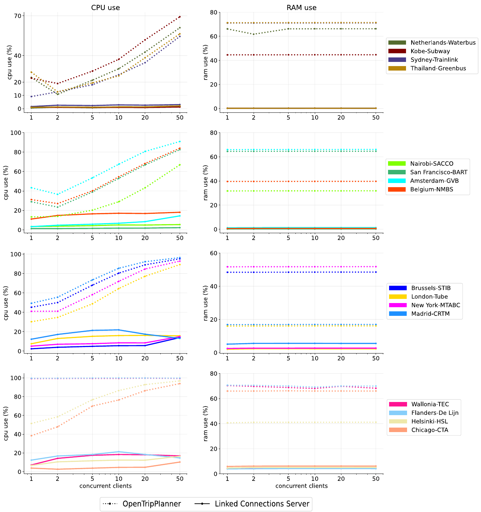
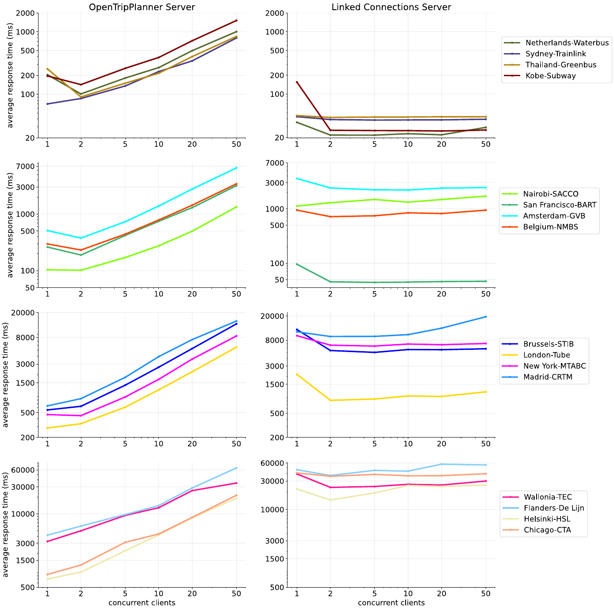
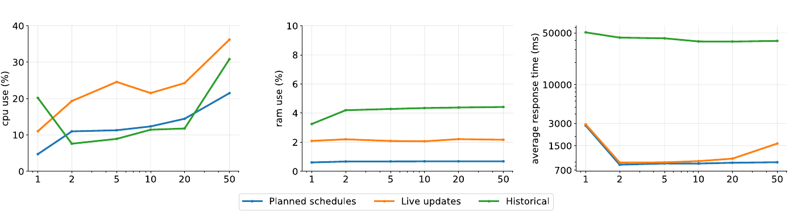

# 3.1.6 Results

In this section we present the measurements obtained during our evaluations. We first present the results of route planning query performance using different fragmentation sizes. Afterwards, we contrast each of the considered metrics against the query performance results and present the calculated statistical correlation measures. Lastly, we show the measured results on cost-efficiency in terms of server-side resources use and query response time for our solution and OpenTripPlanner. We also show the additional costs measured for our solution, when publishing live and historical PT data.

## 3.1.6.1 Experiment 1: Optimal LC fragmentation size

[Figure 3.6](ch_3.1.6_results.md#figure3.6) presents an overview of the results obtained from the route planning performance evaluation, over different sets of LC data fragmentation.

<strong>Figure 3.6.</strong> Average response time of route planning queries (ms) vs fragment sizes (connections) for each PT network. PT networks with similar total number of connections (see <a href="ch_3.1.4_datasets.md#table3.2">table 3.2</a>) are grouped together to facilitate visualizing the results. We labeled the lowest point of each curve where best performance is achieved. Axes use logarithmic scales.

The top left plot in [figure 3.6](ch_3.1.6_results.md#figure3.6), shows the results for the three smallest networks in terms of total connections (&lt; 1,100). Fragmentation was only possible until 500 connections/fragment for *Netherlands-Waterbus* and *Sydney-Trainlink*, and until 1,000 connections/fragment for *Thailand-Greenbus*. Bigger fragmentation for these networks would mean that the entire collection of connections would fit in only one fragment. *Netherlands-Waterbus* shows its best performance (27 ms) with a fragmentation of 100 connections/fragment. *Sydney-Trainlink*'s best performance (45.81 ms) was achieved with 500 connections/fragment, while *Thailand-Greenbus* (36.27 ms) was achieved at 1000 connections/fragment. *Netherlands-Waterbus* shows faster query responses compared to both *Sydney-Trainlink* and *Thailand-Greenbus*, which may be explained by the higher number of connections per query (\\(E(SCQ)\\)) that these networks require to be processed ([table 3.3](ch_3.1.5_evaluation.md#table3.3)). For *Netherlands-Waterbus* we see that 100 connections/fragment appears to be its optimal fragment size, with smaller and bigger fragments rendering worse performance. In the cases of *Sydney-Trainlink* and *Thailand-Greenbus*, the biggest possible fragment for this evaluation (which considers only the network's busiest day) renders the best performance. Bigger fragmentation would be possible when considering the full schedule spanning over multiple days. However, assuming that most queries would be solved within the span of a single day, we could expect that bigger fragments would render worse performance for these networks.

The top right plot in [figure 3.6](ch_3.1.6_results.md#figure3.6), brings together 6 different networks with total amounts of connections ranging between 5,000 and 8,000. Optimal fragmentation values are different for each network, except for *Auckland-Waiheke* and *San Francisco-BART* both with 100 connections/fragment. Despite having the same optimal point and similar amount of connections, they show a significant difference in terms of response time, with 283.67 and 49.84 ms respectively. Referring to [table 3.2](ch_3.1.4_datasets.md#table3.2), we can see that both networks differ significantly for \\(K\\) and \\(D\\): *San Francisco-BART* (\\(K=9.28\\) and \\(D*1000=63.14\\)) and *Auckland-Waiheke* (\\(K=0.15\\) and \\(D*1000=0.41\\)). Where *San Francisco-BART* has much higher values. *San Francisco-BART* has also 3 times more trips but less than half of the stops than *Auckland-Waiheke*. In general we observe the trend of degraded performance as fragmentation moves away from the found optimal point, but with varying degrees of degradation. For example in the case of *Nairobi-SACCO* where almost no degradation is perceived and for *Spain-RENFE* with its best performance (154.23 ms) at the biggest fragmentation possible.

In the bottom left plot of [figure 3.6](ch_3.1.6_results.md#figure3.6), we have a set of 8 PT networks with total amounts of connections ranging between 51,000 and 350,000. Most networks show an optimal fragmentation of 500 and 1,000 connections/fragment, with the exceptions of *Brussels-STIB* and *EU-Flixbus* with 300 and 3,000 connections/fragment respectively. *New Zealand-Bus* shows significanlty worse performance than the rest of the networks, followed by *New York-MTABC* and *Brussels-STIB*. Comparing them to the more performant *Belgium-NMBS* and *London-Tube* we can see that the less performant networks have higher amount of stops and a lower values for \\(K\\) and \\(D\\).

Lastly, on the bottom right plot in [figure 3.6](ch_3.1.6_results.md#figure3.6) we see the results for the remaining 5 networks. These are the biggest networks in the set with total number of connections ranging from 689,000 to 1.2 million. In this case we see a generally degraded performance for all networks. Only *Madrid-CRTM* and *Chicago-CTA* show an optimal fragmentation point on 1000 and 300 connections/fragment respectively. The rest of the networks show their best performance with their smallest fragmentation possible which only degrades further with bigger fragments.

In [figure 3.7](ch_3.1.6_results.md#figure3.7) we present the average query response times, measured using the optimal fragmentation found for each network (as seen on [figure 3.6](ch_3.1.6_results.md#figure3.6)). An annotation can be seen next to every network's bar indicating the average time (in ms) needed to answer the queries of the query sets. At first glance we can see that bigger networks in terms of total number connections and stops are less performant. However, *London-Tube* and *New Zealand-Bus* stand as exceptions on both sides of the spectrum for this trend. *London-Tube* is a relatively big network (321,000 connections) with sub-second performance and *New Zealand-Bus* is a medium size network (153,000 connections) with much worse performance (16.3 s) compared to networks of similar size.

<strong>Figure 3.7.</strong> Measured average response time in milliseconds for the fragmentation that rendered the best performance for each PT network. X-axis uses a logarithmic scale.

## 3.1.6.2 Experiment 2: Correlation of graph metrics and query performance

Results on how the different graph network metrics relate with route planning query performance can be seen on [figure 3.8](ch_3.1.6_results.md#figure3.8). Correlation measures (Pearson Coefficient[^fn121], Covariance[^fn122] and Coefficient of Determination[^fn123]) of each metric are also shown in [table 3.4](ch_3.1.6_results.md#table3.4).

| | \\(r\\) | \\(cov\\) | \\(R^2\\) |
| --- | :---: | :---: | :---: |
| \\(\|V\|\\) | 0.9225 | 9.2e7 | 85.29 |
| connections | 0.8055 | 30.5e8 | 64.88 |
| \\(K\\) | -0.0528 | -13.5e4 | 0.27 |
| \\(D\\) | -0.1499 | -33.6e4 | 2.24 |
| \\(C\\) | -0.0569 | -3.7e3 | 0.32 |
| \\(ACD\\) | -0.2811 | -10.4e4 | 7.90 |

<strong>Table 3.4.</strong> Correlation measurements for each graph metric vs route planning query performance. The measured correlations the Pearson Coefficient (<em>r</em>), Covariance (<em>cov</em>) and the Coefficient of Determination (<em>R2</em>).

The correlation measures ([table 3.4](ch_3.1.6_results.md#table3.4)) related to number of stops (\\(|V|\\)), show a strong and direct correlation with query response time, which is also evident in [figure 3.8](ch_3.1.6_results.md#figure3.8) (upper left). This means that networks with higher amounts of stops, render higher query response times. A similar strong and direct correlation can be observed for number of connections (upper right in [Figure 3.8](ch_3.1.6_results.md#figure3.8)). More connections also means worse performance with a few outlier exceptions. *London-Tube (n9)* and to a lesser extent *Belgium-NMBS (n8)*, show better performance than other networks with similar or even less amount of connections. The opposite behavior is seen on both *Nairobi-SACCO (n10)* and *New Zealand-Bus (n18)* with significant worse performance compared with their peers.

<strong>Figure 3.8.</strong> PT network metrics compared with route planning query performance. Each sub-graph compares one of the metrics to the best query evaluation performance measured for each network (see <a href="ch_3.1.6_results.md#figure3.7">figure 3.7</a>.) Axes are set in logarithmic scale.

Weak and inverse correlations can be observed for both \\(D\\) (center right) and \\(ACD\\) (lower right). Networks with lower values of \\(D * 1000\\) (&lt; 1) show worse query performance, with the exceptions of *Sydney-Trainlink (n2)* and *Auckland-Waiheke (n7)*. In the case of \\(ACD\\), networks with the worst performance (&gt; 10s) always show relatively low \\(ACD\\) (&lt; 3 min). The opposite can also be seen, where most networks with high \\(ACD\\) (&gt; 10 min) show subsecond performance with the exceptions of *EU-Flixbus (n11)* and *France-SNCF (n12)* with close performance values of 2.2s each.

Lastly, no correlation can be seen for the cases of \\(K\\) and \\(C\\), both with Pearson coefficients close to zero and showing high dispersion for query performance.

## 3.1.6.3 Experiment 3: Cost-efficiency of the LC approach

Next we present the results of our two experimental setups for measuring the cost-efficiency of our solution.

### LC vs OpenTripPlanner

In [figure 3.9](ch_3.1.6_results.md#figure3.9) we present the server-side CPU and RAM use for both OpenTripPlanner and the LC Server, while supporting route planning query solving for an increasing amount of concurrent clients. We can see that CPU use for OpenTripPlanner increases proportionally to the number of clients and is also related to the size of the networks (in terms of stops), with bigger networks consuming more processing capacity. The LC Server presents a stable CPU consumption as the number of clients increases, with all networks requiring around 20% of the processor capacity.

<strong>Figure 3.9.</strong> CPU (left column) and RAM (right column) usage under an increasing amount of concurrent clients of OpenTripPlanner and the LC Server for 16 different PT networks. Each row groups 4 networks of similar amount of stops, with smaller networks at the top and bigger networks at the bottom. Dotted lines represent measurements for OpenTripPlanner and continuous lines represent measurements for the LC Server.

In the case of RAM consumption, both OpenTripPlanner and the LC Server remain constant for all networks regardless of the amount of concurrent clients. For all networks, the LC Server does not exceed 10% of RAM use, while OpenTripPlanner reaches up to 70%. In general, the LC Server consumes less CPU and RAM resources and shows a better scalability than OpenTripPlanner.

[Figure 3.10](ch_3.1.6_results.md#figure3.10) presents the obtained results on average query response time for both OpenTripPlanner and the LC Server. The average query response time increases proportionally to the number of concurrent clients for OpenTripPlanner, which reflects the behaviour observed in [figure 3.9](ch_3.1.6_results.md#figure3.9) regarding CPU use. Response times over the LC Server are also aligned to its CPU use and remain relatively stable when the number of clients increases. In terms of absolute numbers, the LC Server completely outperforms OpenTripPlanner for the smallest PT networks of the set (first row) and *San Francisco-BART* (second row). In contrast, OpenTripPlanner significantly outperforms the LC Server for the biggest networks (last row), although response times become similar with 20 and 50 concurrent clients. In the case of middle size PT networks, OpenTripPlanner shows better performance for low amount of concurrent clients (&lt; 10). However, the LC Server shows similar or in some cases better performance for higher amount of concurrent clients (≥ 10), as is the case of *Belgium-NMBS*, *Amsterdam-GVB*, *London-Tube*, *Brussels-STIB* and *New York-MTABC*.

<strong>Figure 3.10.</strong> Average route planning query response times for OpenTripPlanner (left column) and the LC Server (right colum) with an increasing amount of concurrent clients. Each row groups 4 networks of similar amount of stops, with smaller networks at the top and bigger networks at the bottom.

### Live and historical data with LC

[Figure 3.11](ch_3.1.6_results.md#figure3.11) presents the CPU (left) and RAM (center) use, and the average response time of route planning queries (right) of the LC Server when publishing planned schedules only, live schedules updates and historical schedules. In terms of CPU consumptions we see similar behavior for all configurations ranging between 5-38% and having the live updates setup as the most demanding one. RAM consumption remains stable as the number of clients increases and has the historical setup as the most demanding with ~4%. In terms of query response times, both planned only and live updates configuration perform similarly. Query response times over historical data on the other hand, show a significant performance degradation, being ~50 times slower.

<strong>Figure 3.11.</strong> On the left plot is the CPU usage of the LC Server publishing planned only, live updates and historical PT schedules under an increasing amount of concurrent clients. The center plot shows the RAM use for each publishing configuration. The left plot shows the average route planning query response times for each publishing setup of the LC Server.

[^fn121]: Commonly represented as \\(r\\): <https://en.wikipedia.org/wiki/Pearson_correlation_coefficient>
[^fn122]: Commonly represented as \\(cov\\): <https://en.wikipedia.org/wiki/Covariance>
[^fn123]: Commonly represented as \\(R^2\\): <https://en.wikipedia.org/wiki/Coefficient_of_determination>
