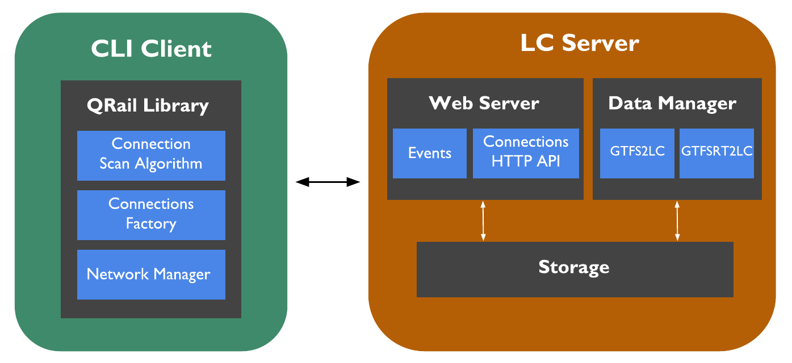

# 3.2.3 Reference architecture

We designed and implemented a system architecture ([figure 3.12](ch_3.2.3_ref-architecture.md#figure3.12)) to evaluate the performance of different strategies for live public transport data sharing on the Web. In this section we present the design choices and implementation details of its different modules.


<div id="figure3.12" style="text-align: center"><strong>Figure 3.12.</strong> Reference architecture used to evaluate polling (HTTP) and push-based (SSE) approaches for publishing and consuming live public transport data for route planning.</div>

## 3.2.3.1 Publishing live public transport updates

We follow the LC specification for public transport data publishing. LC achieves higher *cost efficiency*, compared to equivalent full server-side route planning APIs [@@Colpaert_ICWE_2017]. The data publishing module in the reference architecture is called *LC Server*. For its implementation we extended the [Linked Connections Server](https://github.com/linkedconnections/linked-connections-server) (LCS), given its capabilities of integrating live updates out of the box [@@Rojas_ISWC_2017]. The server is implemented as a Node.js application and consists of the following sub-modules:

* **Data Manager.** Transforms both static and live public transport data to the LC data format. It takes as input GTFS and GTFS-Realtime data sources and uses the [`gtfs2lc`](https://github.com/linkedconnections/gtfs2lc) and [`gtfsrt2lc`](https://github.com/linkedconnections/gtfsrt2lc) libraries to perform data transformations.

* **Web Server.** Exposes polling and push-based Web interfaces that clients use to access static and live data. The polling interface is a HTTP API that provides access to *Connection* documents and to the latest live updates using a reference date as input. The pushing interface is based on SSE and provides clients with updates in vehicle schedules.

* **Storage.** Represents data storage on disk. Documents containing sets of ordered *Connections* and spanning a predefined time window, are created by the *Data Manager* and persisted on disk as files. Data are serialized using the [JSON-LD](https://www.w3.org/TR/json-ld11/) format.

We study the cost and performance of polling and pushing Web interfaces. The polling interface of the LCS defines this access URL:

```text
  {operator}/connections?departureTime={iso-date}
```

Where `operator` is the name of the public transit operator and `iso-date` is the date and time for which a client requires information of vehicle departures. Upon request the LCS retrieves the document that contains *Connections* departing closest to the given departure time. It also checks if there are any available live updates that involve the requested document and merges them. An example of a *Connection* is shown in [listing 3.5](ch_3.2.3_ref-architecture.md#listing3.5).

```json
{
    "@context": {
        "lc": "http://semweb.mmlab.be/ns/linkedconnections#",
        "gtfs": "http://vocab.gtfs.org/gtfs.ttl#"
    },
    "@id": "http://irail.be/connections/8885001/20200131/IC3231",
    "@type": "lc:Connection",
    "lc:departureStop": "http://irail.be/stations/NMBS/008885001",
    "lc:arrivalStop": "http://irail.be/stations/NMBS/008885068",
    "lc:departureTime": "2020-01-31T09:54:00.000Z",
    "lc:arrivalTime": "2020-01-31T09:58:00.000Z",
    "lc:departureDelay": 60,
    "lc:arrivalDelay": 60,
    "lc:direction": "Courtrai",
    "gtfs:trip": "http://irail.be/vehicle/IC3231/20200131",
    "gtfs:route": "http://irail.be/vehicle/IC3231",
    "gtfs:pickupType": "gtfs:Regular",
    "gtfs:dropOffType": "gtfs:Regular"
}
```
<div id="listing3.5" style="text-align: center"><strong>Listing 3.5.</strong> LC formatted as JSON-LD. The properties <em>departureDelay</em> and <em>arrivalDelay</em> indicate that live data is available for this <em>Connection</em>.</div>

Schedule documents can be cached by clients, which can reuse them to answer more than one query. This reduces the amount of requests that need to be handled by the server. However, live updates quickly invalidate caches and clients need to request again updated LC documents for new queries. In the worst case, all *Connections* of a document change due to a live update, but the majority of the time only a handful of *Connections* are updated, causing that significant parts of LC documents are sent over and over again. For this reason, we extended the LCS implementation and added a new resource to its HTTP API that allows to retrieve only *Connections* that have changed since a given time: `{operator}/events?lastSyncDate={iso-date}`. This resource allows clients to synchronize their local caches with the latest available data.

We also implemented a pushing Web interface using SSE. Clients can subscribe to it on `{operator}/events/sse` and receive the latest schedule updates as they occur. We use the W3C standardized SOSA ontology to identify and semantically describe schedule updates for particular *Connections*. Our [implementation is available online](https://github.com/DylanVanAssche/linked-connections-server).

## 3.2.3.2 Consuming live public transport updates

A [command line interface (CLI) client application](https://github.com/DylanVanAssche/QRail/tree/develop/cli/qrail-cli) was implemented for processing route planning queries on top of LC-based data. It implements the CSA algorithm on its *Profile* variant [@@Dibbelt_JEA_2018]. This allows calculating not only the *Earliest Arrival Time* but also later route alternatives, providing a maximum amount of desired vehicle transfers along the way. The selection of this algorithm is based on the data model defined by the LC specification. LC defines a sorted by departure time array of *Connections*, which is the data structure that CSA requires to process queries.

This client consist of a library called [*QRail Library*](https://github.com/DylanVanAssche/QRail) that was built using the [Qt framework](https://www.qt.io/). We selected this framework due to its cross-platform portability including Android or iOS. The client's modules are the following:

* **Network Manager.** Handles the communication capabilities of the client. It was built by extending the Qt *QNetworkAccessManager* library to handle SSE-based interactions. It keeps an in-memory local cache to store the latest available schedule information.

* **Connections Factory.** Retrieves data (either from cache or from the server) and builds *Connection* Qt objects to calculate route plans.

* **Connection Scan Algorithm.** Contains the implementation of the CSA *Profile* variant.

## 3.2.3.3 Dynamic rollbacks for CSA

We extended CSA to address the problem of needing to perform complete route plan re-calculations, every time a new update is available on the client. Full route plan re-calculations increase the amount of requests and processing that both clients and servers need to handle, thus increasing computational costs.

Given a route plan query (e.g., from Bruges to Brussels departing today at 17:00), CSA starts its execution by scanning *Connections* departing no earlier than 17:00 until it finds the earliest arrival route. From this point, the algorithm performs predefined scan cycles, going back in time over the *Connections* array and adding every time for example, 30 minutes to the earliest arrival time. This allows finding later alternative route plans for the given query.

In our implementation, every time a new *Connections* document is requested during algorithm execution, we create a snapshot of CSA's internal state containing the *Connections* currently involved in the, so far discovered routes. Thanks to these snapshots we can determine the exact index in the *Connections* array, from which CSA needs to recalculate when there are updates in the route plans. Given that CSA *Profile* goes back in time over the *Connections* array, the closer an updated *Connection* is to the departure stop, the faster the recalculation process will be. The set of snapshots is kept in memory and updated every time a new query is processed.
