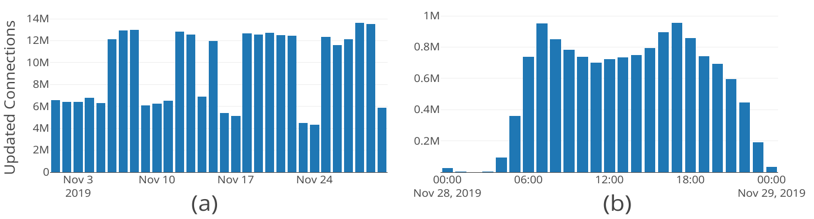

# 3.2.4 Evaluation

We study different approaches to efficiently publish and consume live public transport data, in terms of computational resources (CPU, RAM and bandwidth) and route planning query processing performance. For this we define the following research questions:

* **RQ1.** What is the most *cost-efficient* approach, in terms of computational resources, to publish live public transport data, considering polling and push-based technologies in a LC-based architecture?
* **RQ2.** What is the impact of polling and push-based approaches on LC-based clients, in terms of computational resources and route planning query processing?
* **RQ3.** What is the impact of the CSA rollback mechanism on the performance of a LC-based client for route planning query processing in terms of execution time?

To address these research questions, we defined a hypothesis for each of them:

* **H1.** A pushing approach will lower resource consumption on average, due to avoiding processing new client requests to obtain new schedule updates.
* **H2.** A pushing approach has lower computational cost on clients, since is not necessary to send every time a new request to the server to get the latest updates, thus reducing bandwidth and communication establishment processes.
* **H3.** On average, a rollback mechanism results in lower processing times for processing route planning queries.

We designed two different experiments to test our hypotheses. Next, we describe the testing data and the setups for each of the experiments.

## 3.2.4.1 Real-world test data

We used real data from the [Belgian railway operator NMBS](https://www.belgiantrain.be/). NMBS publishes both [GTFS and GTFS-Realtime data dumps as open data](https://www.belgiantrain.be/en/3rd-party-services/mobility-service-providers/public-data). We collected the timetable and all emitted live updates for November 2019 (we make the [data available online](https://github.com/julianrojas87/ICWE2020-results)). We analyzed these data to understand how live updates happen, i.e., what the low and peak hours normally are, to run our experiments considering representative data. [Figure 3.13](ch_3.2.4_evaluation.md#figure3.13)(a) shows the amount of *Connections* updated during the entire month, having the 28th of November as the day with the highest amount (over 13.63 million). [Figure 3.13](ch_3.2.4_evaluation.md#figure3.13)(b) zooms in into this day, clearly showing peak hours around 07:00 and 17:00, and registering 17:00 as the peak hour of the day with more than 900,000 updated *Connections*.

<strong>Figure 3.13.</strong> The amount and distribution of <em>Connection</em> updates allow to visualize the behavior of the transport network regarding its low and peak times. Week days and especially their mornings and afternoons, consistently show higher number of updates.

We used the [iRail query log dataset](https://gtfs.irail.be/logs/) as a reference. This dataset contains a registry of over one million real route planning queries per day, received by the [iRail API](https://api.irail.be/). We analyzed the queries that were executed on the week days during November 2019 and classified them by the amount of *Connections* used by their *Earliest Arrival Time* route, since routes with higher amount of *Connections* require a higher processing effort to be computed.

## 3.2.4.2 Experiment 1: Pushing live transport updates

The first experiment was designed to test the computational resource (CPU, RAM and bandwidth) consumption of LC-based live public transport data publishing, following polling (HTTP API) and push-based (SSE) approaches. We setup a server with a Quad core Intel E5520 (2.2GHz) CPU and 12 GB of RAM. We progressively instantiate up to 1500 clients requesting/receiving live data updates. Each client starts its operation 0.5 seconds after the previous to avoid overload peaks on the measurements and simulate a more realistic environment, where clients issue requests at any point in time and not necessarily synchronized with the live updates frequency.

For the polling scenario every client requests a new data update every 30 seconds, which corresponds to the update frequency of NMBS GTFS-Realtime feed. We also disabled serve-side caching, to obtain a clearer image of the actual operational costs of the server. In the pushing scenario, the clients subscribe once to the SSE interface and the server pushes new data to them every 30 seconds. The experiment was executed during 20 minutes for each scenario.

## 3.2.4.3 Experiment 2: Consuming live transport updates

The second experiment was designed to measure the CPU, RAM and bandwidth usage of a LC-based client, consuming live public transport updates following polling (HTTP API) and push-based (SSE) approaches. The client application was deployed on a machine with a Quad core Intel E5520 (2.2GHz) CPU and 12GB of RAM. We handpicked routes with different amount of updated *Connections*. This was intended to avoid evaluating routes without updates and thus, with no significant impact on client resources.

We ran the experiment for each selected query using our client on a polling and a pushing scenario, and a reference test client without the rollback mechanism described in [section 3.2.3.3](ch_3.2.3_ref-architecture.md#3233-dynamic-rollbacks-for-csa). The evaluation run for 15 minutes on each scenario, where clients requested/received live updates every 30 seconds. [Table 3.5](ch_3.2.4_evaluation.md#table3.5) shows an overview of the selected routes.

| From | To | *Connections* | Travel time (min) |
| :---: | :---: | :---: | :---: |
| Hasselt | Sint-Truiden | 2 | 15 |
| Leuven | Diest | 2 | 32 |
| Landen | Diest | 5 | 43 |
| Eppegem | Brussels-Shuman | 6 | 23 |
| Mechelen | Brussels-Congress | 6 | 30 |
| Leuven | Schaarbeek | 11 | 29 |
| Asse | Antwerp-Berchem | 18 | 87 |
| Antwerp-Central | Alken | 23 | 94 |

<strong>Table 3.5.</strong> Set of route planning queries extracted from the iRail API logs. This table shows the number of <em>Connections</em> and the total travel time of the <em>Earliest Arrival Time</em> route.

