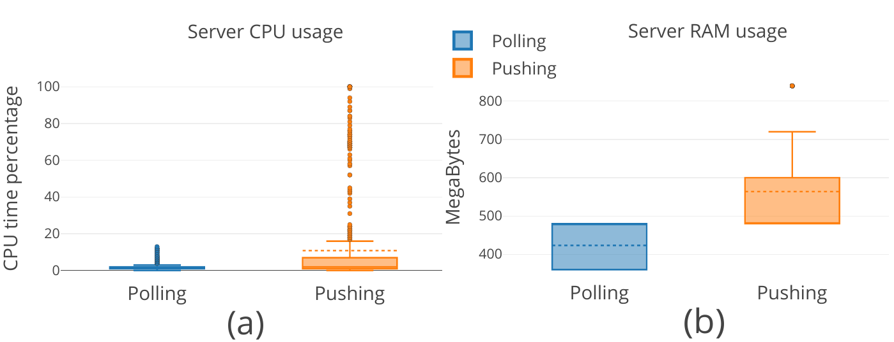
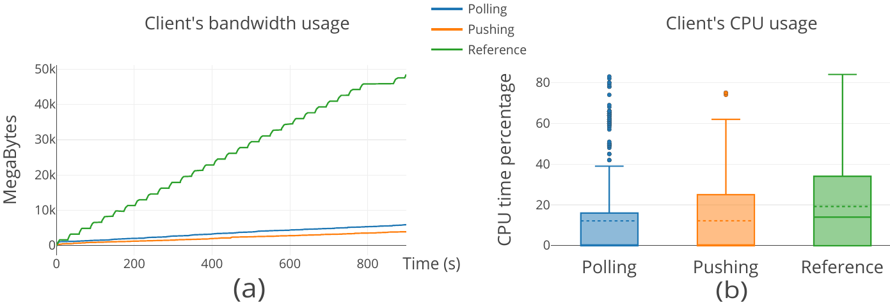
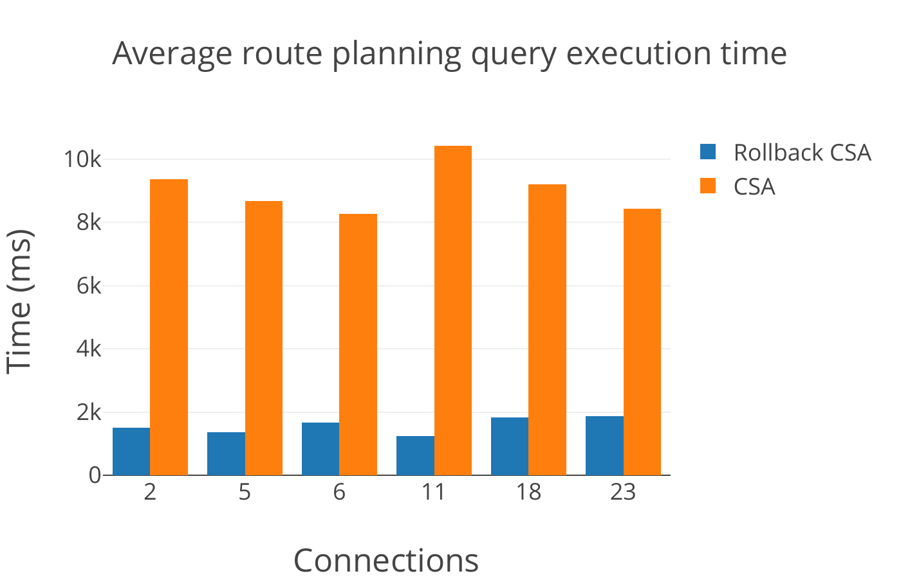

# 3.2.5 Results

Here we present the results obtained for the experiments described in [section 3.2.4](ch_3.2.4_evaluation.md).

[Fig. 3.14](ch_3.2.5_results.md#figure3.14) presents the measurements made for Experiment 1. [Fig. 3.14](ch_3.2.5_results.md#figure3.14)(a) shows a mean CPU usage of 10.8% for the pushing approach. For the polling approach we obtained a mean usage of 1.7%.

In terms of RAM, [Fig. 3.14](ch_3.2.5_results.md#figure3.14)(b) shows a mean consumption of 563.8MB for the pushing approach. For the polling approach we measured a mean consumption of 423MB. Bandwidth measurements for pushing showed a total data exchange of 6.5 GB serving up to 1,500 clients during the measured time (20 mins). For pulling, the server exchanged a total of 15.8 GB under the same conditions (figure not included for the sake of space).

<strong>Figure 3.14.</strong> Polling shows a lower resource consumption for both CPU and RAM.

[Figure 3.15](ch_3.2.5_results.md#figure3.15)(a) shows the bandwidth usage for the three test scenarios, defined in Experiment 2. After 800 seconds the reference client exchange a total of 45.7MB. The rollback clients exchanged 5.4MB and 3.6MB for polling and pushing respectively. In terms of RAM ([figure 3.15](ch_3.2.5_results.md#figure3.15)(b)), no significant difference was measured for polling and pushing with a mean consumption of 70.6MB and 71.1MB respectively. The reference client shows an increased average RAM usage of 102.1MB. CPU usage (figure not shown for the sake of space) maintained the same tendency with average consumption of 12.15% (polling), 12.22% (pushing) and 19.2% (reference).

<strong>Figure 3.15.</strong> The rollback clients give a significant reduction of bandwidth. There are no major differences in terms of RAM consumption.

[Figure 3.16](ch_3.2.5_results.md#figure3.16) presents the results obtained for testing our rollback mechanism and its impact on route planning query processing. The rollback mechanism is between 8-10 times faster in every set of route planning queries.

<strong>Figure 3.16.</strong> The rollback mechanism significantly improves the performance of query recalculation.

