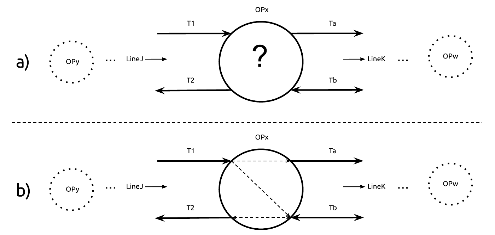

# 4.3.2 External data source

There are known limitations for ERA's base registries, as is the case of RINF and the limited granularity it gives over the railway topology. RINF provides a view over the railway infrastructure, commonly referred as a meso-level view[^fn165], where complex topological structures inside stations, junctions, switches, etc., are abstracted into single nodes in the network graph. Route calculations over this limited view, may wrongfully assume certain direction changes, not possible in the real world. Calculating end-to-end routes with high accuracy, requires further data about the connectivity within each network node. This connectivity issue currently stands as one of the main challenges, for an accurate and reliable data source description of the European railway infrastructure topology. For this reason we also consider an external data source, provided by the Dutch IM ProRail, which provides an additional topological description for addressing this issue limited to the region of Utrecht in The Netherlands.

## 4.3.2.1 Connectivity data in the Utrecht area

The Dutch IM ProRail, provided us with an additional data source for exploring an alternative solution for the lack of real information about the internal connectivity inside network nodes (also called operational points). It consists of a table that groups all the different permutations of incoming and outgoing tracks for a set of operational points, and states if they are connected or not.

The operational point `OPx` ([figure 4.1](ch_4.3.2_external.md#figure4.1)) has two incoming tracks (`T1` and `T2`) from `OPy` and belonging to the national line `LineJ`. We know these are incoming tracks thanks to the logical direction defined for `LineJ`, despite `T1` being a bidirectional track. `OPx` also has two outgoing tracks (`Ta`, `Tb`), going towards `OPw` and belonging to another national line `LineK`. Based on this information we establish the correct connectivity that reflects real-world behavior.

| IN_Line | IN_OP | IN_Track | OP | OUT_Track | OUT_OP | OUT_Line | Connected |
| :---: | :---: | :---: | :---: | :---: | :---: | :---: | :---: |
| LineJ | OPy | T1 | OPx | Ta | OPw | LineK | **true** |
| LineJ | OPy | T1 | OPx | Tb | OPw | LineK | **true** |
| LineJ | OPy | T2 | OPx | Ta | OPw | LineK | **false** |
| LineJ | OPy | T2 | OPx | Tb | OPw | LineK | **true** |

<strong>Table 4.1.</strong> All the possible permutations between incoming and outgoing tracks of OPx, plus a column that states if there is a possible connection between two pairs of tracks.

<strong>Figure 4.1.</strong> a) a schematic diagram of an operational point where its internal connections are unknown; b) how this information can be completed from data provided in <a href="ch_4.3.2_external.md#table4.1">table 4.1</a>.

[^fn165]: See section 1.6 of [@@IRS_30100] for a description of railway view levels.
