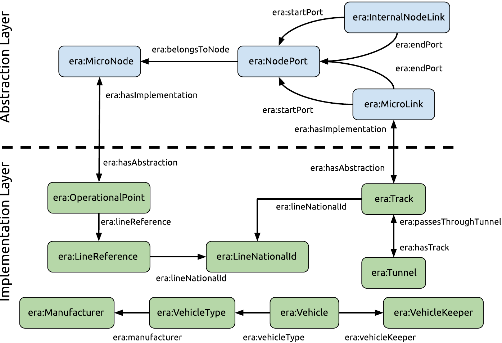
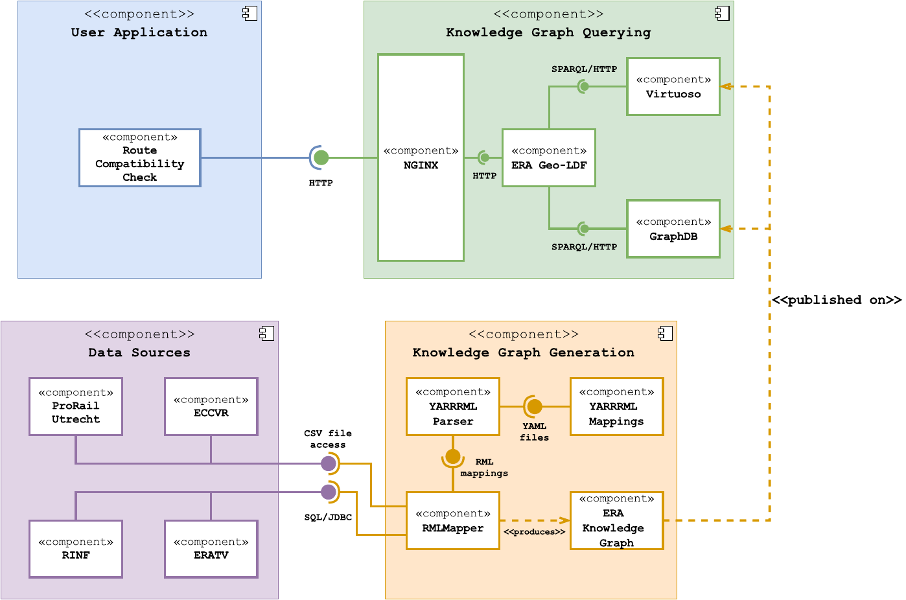
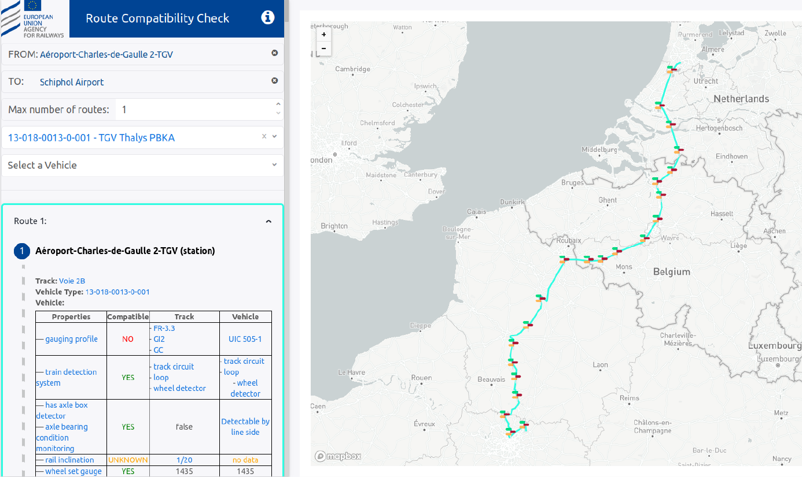

# 4.4 Proposed solution

Considering the interoperability obstacles that exist among the base registries maintained by ERA, we propose and design a solution architecture, capable of creating a semantic interoperability layer for data integration over them. Moreover, we exploit the inherent flexibility of graph-based data models to also include an external data source, that enriches the resulting Knowledge Graph (KG) and addresses intrinsic limitations of the original base registries. The proposed architecture relies on an ontology, defined to cover, but not limited to, the explicit interoperability requirements brought forth by the RCC use case. The architecture implements an ETL (Extract Transform Load)-based pipeline that relies on a fully declarative approach for the KG generation process, and leverages fundamental Web principles such as caching, to reduce computational infrastructure costs while maintaining a high querying flexibility.

In this section we present a description of the main architectural components of our proposed solution. We describe the proposed ontology and give an full overview of the solution architecture, which includes a fully functional application to support route compatibility ([checks available online](https://data-interop.era.europa.eu/route-compatibility)).

## 4.4.1 The ERA vocabulary

Our proposed ontology, the [ERA Vocabulary](https://data-interop.era.europa.eu/era-vocabulary/), was created in a collaborative effort with domain experts from ERA, ProRail, SNCF and Semantic Web experts from DG DIGIT and IDLab-imec. The ERA Vocabulary provides unique identifiers and semantic definitions for concepts and properties, common to the railway domain. We make available online its documentation, using Widoco [@@Garijo_Zenodo_2020] as a template generator, and the source files in a [public GitHub repository](https://github.com/Interoperable-data/ERA_vocabulary).

Following Semantic Web best practices, the ontology reuses external ontologies such as OGC GeoSPARQL, Schema.org and the [EU publications office authority table](http://publications.europa.eu/resource/authority/country) for country definitions. It defines a layered model (see [figure 4.2](ch_4.4_solution.md#figure4.2)), inspired from RINF's relational model, where the topological and functional aspects of the railway infrastructure are defined by independent entity types. The *abstraction* layer defines logical entities form the network topology graph, with `era:NodePorts` acting as nodes and both `era:MicroLinks` and `era:InternalNodeLinks` acting as edges. The *implementation* layer, represents concrete and functional objects in the real world, such as tracks, operational points (stations, switches, etc.) and vehicles (types). The link between these two layers is given by the `era:MicroNode` - `era:OperationalPoint` and `era:MicroLink` - `era:Track` relationships. Additionally, 28 [reference datasets](https://data-interop.era.europa.eu/era-vocabulary/skos/index.html) were extracted from the base registries and defined as SKOS controlled vocabularies. They contain definitions for different domain-related technical aspects, which are envisioned to be independently managed by relevant authorities.

<strong>Figure 4.2.</strong> Layered data model of the ERA Vocabulary.

## 4.4.2 Architecture overview

Our proposed solution architecture is composed by 4 main modules (see [figure 4.3](ch_4.4_solution.md#figure4.3)), namely the *Data Sources*, *KG Generation*, *KG Querying* and *User Application* modules. The *Data Sources* module represents the considered data sources (previously described in [section 4.3.1](ch_4.3.1_base-registries.md)). The components from the *KG Generation* module, access the data sources to produce the RDF triples that compose the ERA KG. The ERA KG is published and made available for querying by the *KG Querying* module, which provides the necessary interfaces for the *User Application* module to support specific use cases. Next, we provide a description and the rationale behind these modules.

<strong>Figure 4.3.</strong> Overview of the proposed solution architecture for semantic data interoperability across ERA's base registries.

### 4.4.2.1 KG Generation

The KG generation process in our solution follows an ETL-based approach and uses the RML [@@Dimou_LDOW_2014] technology stack for declaratively generating the RDF triples of the ERA Knowledge Graph. RML was selected for handling heterogeneous data sources, which in our case are relational databases and CSV files, but XML Schema-based data sources (e.g., RailML) are also envisioned as a next step. The steps followed in this process are:

1. Definition of [RML rules](https://github.com/julianrojas87/era-data-mappings) in YARRRML [@@Heyvaert_ESWC_2018] syntax.
2. Translation of YARRRML rules to RML using the [yarrrml-parser](https://github.com/RMLio/yarrrml-parser).
3. Production of RDF data via the [RMLMapper](https://github.com/RMLio/rmlmapper-java), according to the set of given RML rules.
4. Publishing of the resulting KG in a triple store. At the time of writing the ERA KG, had a total of 13.8 million triples, which we also make available as a [raw data dump](https://drive.google.com/file/d/1KofPzYx2ovgAz85rLuO5J98SEs2BjWbO/view?usp=sharing).

### 4.4.2.2 KG Querying

We published the ERA KG in two different triple stores (GraphDB and [Virtuoso](https://virtuoso.ecdp.tech.ec.europa.eu/sparql)) to prove that our proposed solution is vendor-independent. This module includes one of the core components of the architecture: the ERA Geo-LDF, which is implemented as a [Node.js application](https://github.com/julianrojas87/era-ldf/). The main purpose of this component is exposing a Linked Data and Hypermedia-based API over the ERA KG. It builds on the Linked Data Fragments [@@Verborgh_CEUR_2014] approach to provide metadata annotated fragments (tiles) of the ERA KG, based on a predefined geospatial pattern. It follows the [slippy maps specification](https://wiki.openstreetmap.org/wiki/Slippy_map_tilenames), where the grid-based partition of the world is specified based on a zoom level `z` and the `x` and `y` cartesian coordinates. A live example of a tile for the area of Brussels can be accessed on <http://era.ilabt.imec.be/ldf/sparql-tiles/implementation/10/524/343>.

The tiles are built by the ERA Geo-LDF component via template SPARQL queries that select and filter the entities based on their geospatial properties. In this way, client applications can request relevant data for their purposes and since the API returns unmodified triples from the KG, further querying and processing becomes possible on the client-side. Following this approach, we address the limitation of performing graph path finding queries directly on the SPARQL endpoints. Our client application implements a shortest-path algorithm and proceeds to download the relevant tiles based on the geospatial information given by origin-destination queries. Furthermore, tiles can be cached both on client- and server-side, which reduces the overall computational load on the server and improves query performance for client applications.

### 4.4.2.3 User Application

This module represents any user-oriented applications that would perform querying tasks over the ERA KG to support a given use case. We developed a React-based [Web application](https://github.com/julianrojas87/era-compatibility-check) for supporting the RCC use case and demonstrating data interoperability via the ERA KG (see [figure 4.4](ch_4.4_solution.md#figure4.4)). The application allows users to select an origin-destination pairs of operational points (visible in map-based UI) to calculate one or more routes between them. Once selected, it proceeds to download the relevant KG tile fragments and perform the path finding process. It handles RDF triples natively and implements the A* [@@Hart_TSSC_1968] and Yen's [@@Yen_MS_1971] algorithms for graph shortest path and top-k shortest path calculations respectively. Once a route is found, users may select a vehicle (type) to assess technical compatibility. Currently the application evaluates compatibility for 15 different parameters of both track sections and vehicle (types). Users can also visualize the internal connectivity of operational points that form part of a calculated route, by means of a schematic diagram that shows the possible internal connections defined in the ERA KG. This feature is particularly interesting for operational points around the city of Utrecht in The Netherlands, considering the additional data source from ProRail ([Section 4.3.2](ch_4.3.2_external.md)), that was integrated into the KG.

<strong>Figure 4.4.</strong> The RCC Web application: a route calculated from the Charles de Gaulle airport in Paris to the Schipol airport in Amsterdam. On the lower left panel, the results of the compatibility check process for the TGV Thalys PBKA vehicle type are shown.

